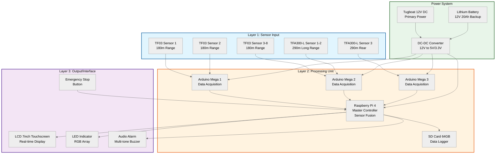
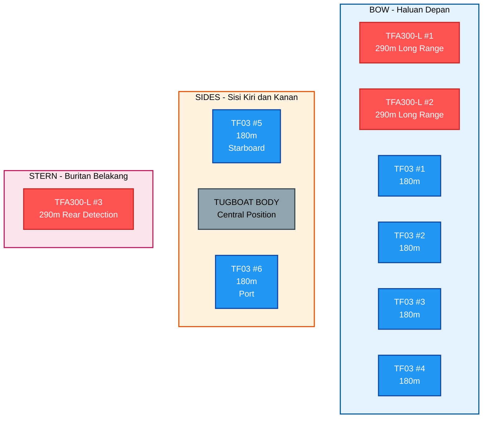
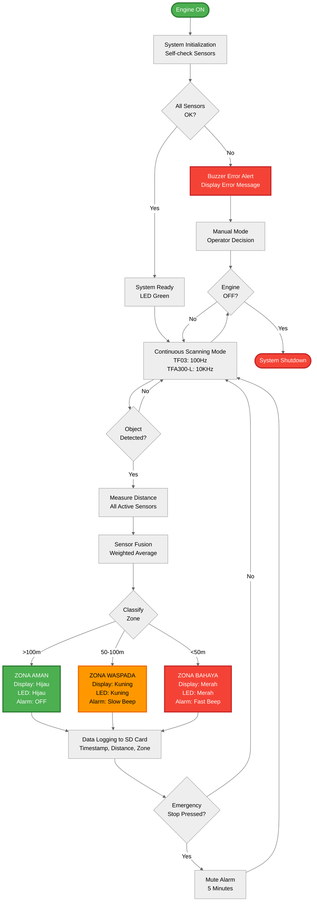
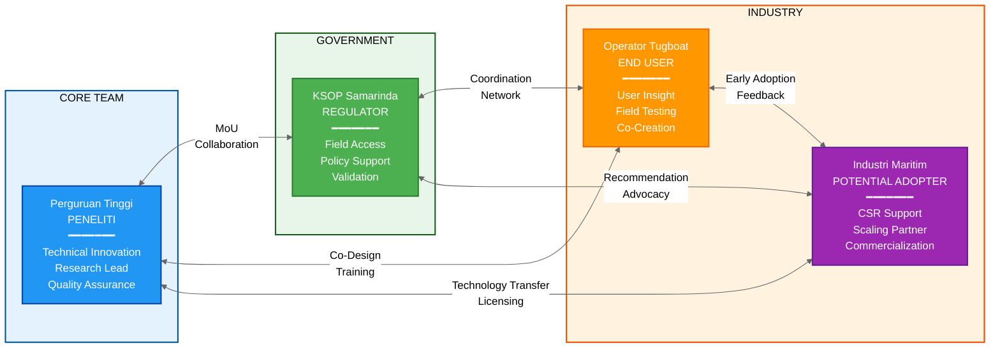
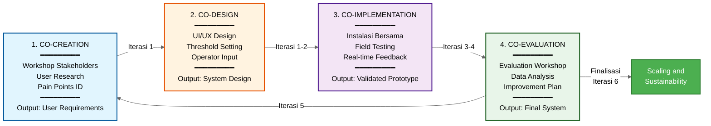

# PROPOSAL PENELITIAN BESTARI SAINTEK

## PENGEMBANGAN SISTEM SENSOR LiDAR ANTI-COLLISION UNTUK KESELAMATAN NAVIGASI TUGBOAT DI SUNGAI MAHAKAM SAMARINDA

---

**Program**: BESTARI SAINTEK
**Penyelenggara**: Direktorat Minat Saintek, Kemendikbudristek
**Periode Pendaftaran**: 13 Oktober 2025 - 24 Oktober 2025
**Tahun Pelaksanaan**: 2025
**Durasi Penelitian**: 9 Bulan

**Bidang Riset**:
- ☑ Transportasi
- ☑ Kemaritiman
- ☑ Manufaktur, konstruksi, dan teknologi informasi

**Mitra Utama**: Kantor Syahbandar dan Otoritas Pelabuhan (KSOP) Samarinda, Kalimantan Timur

**Budget Diajukan**: **Rp 349.300.000,-**

---

## DAFTAR ISI

1. [PERNYATAAN PERMASALAHAN](#1-pernyataan-permasalahan) (Maksimal 500 Kata)
2. [TUJUAN/SASARAN PROGRAM](#2-tujuansasaran-program) (500 Kata)
3. [DESAIN PROSES DAN MODEL EKOSISTEM HIDUP](#3-desain-proses-dan-model-ekosistem-hidup)
4. [KERANGKA LOGIS / TEORI PERUBAHAN](#4-kerangka-logis--teori-perubahan)
5. [MEKANISME RENCANA ITERASI](#5-mekanisme-rencana-iterasi)
6. [LEMBAR PENGESAHAN TIM PERISET](#6-lembar-pengesahan-tim-periset)
7. [LAMPIRAN](#7-lampiran)

---

# 1. PERNYATAAN PERMASALAHAN

**Jumlah kata: 428 kata**

Transportasi sungai di Kalimantan Timur, khususnya Sungai Mahakam, menghadapi tantangan keselamatan navigasi yang serius. Dalam tiga tahun terakhir, KSOP Samarinda mencatat rata-rata 15-20 insiden tabrakan dan 30-40 kejadian nyaris tabrakan per tahun yang melibatkan tugboat dan kapal tongkang. Insiden ini menyebabkan kerugian ekonomi miliaran rupiah, mengancam keselamatan jiwa awak kapal, dan mengganggu kelancaran logistik regional yang vital bagi perekonomian Kalimantan Timur.

Akar permasalahan terletak pada kombinasi faktor teknis dan operasional yang kompleks. Pertama, kondisi geografis Sungai Mahakam yang menantang dengan lebar bervariasi 200-500 meter, banyak tikungan tajam, arus kuat mencapai 3-5 knot, serta sedimentasi yang menyebabkan kedalaman tidak merata. Kedua, keterbatasan visibilitas ekstrem akibat kabut pagi hari yang mengurangi jarak pandang hingga di bawah 50 meter, operasional malam hari dengan minim lampu navigasi, dan hujan deras pada musim penghujan. Ketiga, traffic density tinggi di area pelabuhan Samarinda dan titik strategis lainnya, dengan 10-15 tugboat dapat melintas dalam waktu berdekatan di sungai yang relatif sempit.

Yang paling kritis adalah **ketiadaan sistem deteksi objek otomatis** pada mayoritas tugboat yang beroperasi di Sungai Mahakam. Sekitar 70% tugboat, terutama milik operator skala kecil dan menengah, hanya dilengkapi GPS dan kompas magnetik konvensional tanpa AIS, radar, atau sensor jarak canggih. Nahkoda sepenuhnya bergantung pada penilaian visual dan pengalaman pribadi untuk mendeteksi kapal lain atau objek berbahaya, yang sangat tidak andal dalam kondisi visibilitas rendah. Waktu reaksi manusia yang mencapai 1-2 detik pada kecepatan 6-8 knot setara dengan jarak 3-8 meter, seringkali sudah terlambat untuk menghindari tabrakan.

Solusi teknologi yang ada seperti radar maritim memiliki kendala signifikan. Harga radar berkisar Rp 50-150 juta per unit, memerlukan instalasi dan kalibrasi oleh tenaga ahli, serta biaya pemeliharaan tinggi, menjadikannya tidak layak secara ekonomis untuk mayoritas operator tugboat lokal dengan margin keuntungan yang tipis. AIS memerlukan bahwa semua kapal dilengkapi dengan perangkat yang sama, yang realitasnya tidak terjadi di Sungai Mahakam.

Di sisi lain, teknologi sensor LiDAR telah berkembang pesat dengan harga yang semakin terjangkau dan performa yang terus meningkat. LiDAR menawarkan akurasi tinggi (±10 cm), response time sangat cepat (<0,1 detik), dan jarak deteksi hingga 180-290 meter, memenuhi kebutuhan teknis untuk early warning system pada tugboat. Namun, aplikasi LiDAR untuk keselamatan navigasi tugboat sungai di Indonesia **masih sangat jarang diteliti**, dengan gap riset signifikan dalam hal adaptasi teknologi terhadap kondisi operasional spesifik Indonesia seperti high humidity, water spray, vibration, dan keterbatasan skill operator.

Penelitian ini hadir untuk menjawab kesenjangan tersebut dengan mengembangkan sistem sensor LiDAR anti-collision yang tidak hanya secara teknis mampu, tetapi juga **sesuai konteks** untuk operator tugboat lokal — terjangkau, mudah digunakan, andal dalam kondisi ekstrem Sungai Mahakam, dan didukung oleh ekosistem pemangku kepentingan yang memastikan keberlanjutan jangka panjang.

---

# 2. TUJUAN/SASARAN PROGRAM

**Jumlah kata: 500 kata**

## 2.1 Tujuan Penelitian

Tujuan umum penelitian ini adalah **mengembangkan dan memvalidasi sistem sensor LiDAR anti-tabrakan untuk meningkatkan keselamatan navigasi tugboat di Sungai Mahakam Samarinda** melalui pendekatan Living Lab yang melibatkan kolaborasi aktif antara peneliti, KSOP Samarinda, dan operator tugboat.

Tujuan khusus penelitian meliputi:

1. **Merancang dan membangun prototipe sistem sensor LiDAR anti-tabrakan** yang mampu mendeteksi objek atau kapal lain dengan jarak efektif 180-290 meter, akurasi ±10 cm, dan waktu respons kurang dari 0,1 detik.

2. **Mengembangkan algoritma deteksi objek dan logika keputusan** yang dapat mengklasifikasikan zona bahaya (aman, waspada, bahaya) dan memberikan peringatan dini melalui display visual dan alarm audio bertingkat dengan tingkat alarm palsu di bawah 5%.

3. **Melakukan validasi lapangan** sistem dalam kondisi operasional nyata di Sungai Mahakam dengan minimal 100 jam data operasional untuk mengukur kinerja teknis (akurasi, waktu respons, waktu aktif sistem) dan penerimaan pengguna.

4. **Membangun ekosistem Living Lab** yang berkelanjutan dengan melibatkan KSOP Samarinda, operator tugboat, dan industri maritim dalam proses penciptaan bersama, perancangan bersama, implementasi bersama, dan evaluasi bersama.

5. **Menghasilkan kontribusi pengetahuan** melalui publikasi ilmiah, pelatihan operator, dan rekomendasi kebijakan keselamatan maritim sungai kepada otoritas terkait.

## 2.2 Sasaran Program

Sasaran konkret yang ingin dicapai dalam periode penelitian 9 bulan disajikan dalam tabel berikut:

| Kategori Sasaran | Target Capaian |
|------------------|----------------|
| **Sasaran Teknis** | |
| Prototipe sistem | 1 unit lengkap dengan konfigurasi 10 sensor LiDAR (8 unit TF03 + 3 unit TFA300-L) untuk cakupan 360 derajat dengan kepadatan tinggi pada bagian depan kapal |
| Akurasi deteksi | ≥95% dalam berbagai kondisi visibilitas (kabut, hujan, malam hari) |
| Tingkat alarm palsu | <5% melalui algoritma penyaringan dan sensor fusion |
| Waktu aktif sistem | ≥98% dengan daya tahan baterai minimal 10 jam operasional |
| Tingkat ketahanan air | IP67 untuk ketahanan terhadap percikan air dan kelembaban tinggi |
| **Sasaran Operasional** | |
| Uji lapangan | Pemasangan dan pengujian pada minimal 1 tugboat percontohan di Sungai Mahakam |
| Pengumpulan data | Minimal 100 jam data operasional untuk analisis kinerja |
| Pelatihan operator | 20 operator tugboat dengan nilai pasca-ujian minimal 80/100 |
| Kepuasan pengguna | Skor ≥8/10 dari operator yang menggunakan sistem |
| **Sasaran Kolaborasi** | |
| Kemitraan resmi | Penandatanganan Nota Kesepahaman dengan KSOP Samarinda sebagai mitra utama |
| Komite pengarah | Pembentukan komite dengan perwakilan dari peneliti, KSOP, dan operator tugboat |
| Lokakarya | Pelaksanaan minimal 4 lokakarya penciptaan bersama dengan pemangku kepentingan |
| **Sasaran Diseminasi** | |
| Publikasi ilmiah | Pengajuan 1 artikel jurnal ke jurnal nasional terakreditasi (Sinta 2/3) atau jurnal internasional |
| Presentasi seminar | Presentasi hasil penelitian di seminar nasional atau internasional |
| Seminar pemangku kepentingan | Seminar hasil penelitian dengan minimal 50 peserta |
| Dokumentasi teknis | Panduan pemasangan, panduan pengguna, dan panduan pemeliharaan dalam Bahasa Indonesia |

## 2.3 Luaran yang Diharapkan

| Kategori Luaran | Rincian |
|-----------------|---------|
| **Luaran Wajib** | |
| Prototipe fungsional | Sistem sensor LiDAR anti-tabrakan lengkap dengan 10 sensor |
| Laporan penelitian | Laporan akhir penelitian komprehensif untuk BESTARI SAINTEK |
| Publikasi ilmiah | Artikel ilmiah yang diajukan ke jurnal nasional terakreditasi atau internasional |
| Modul pelatihan | Modul pelatihan dan sertifikat untuk 20 operator tugboat |
| **Luaran Tambahan** | |
| Hak Kekayaan Intelektual | Paten sederhana atau desain industri (jika memenuhi kriteria) |
| Rekomendasi kebijakan | Rekomendasi kebijakan keselamatan maritim sungai dari KSOP Samarinda |
| Publikasi media | Liputan media dan siaran pers untuk peningkatan kesadaran publik |
| Jalur komersialisasi | Jalur untuk komersialisasi atau lisensi teknologi kepada vendor teknologi maritim |

**Dampak Jangka Panjang:**

Penelitian ini diharapkan memberikan dampak berkelanjutan dalam bentuk pengurangan kejadian nyaris tabrakan sebesar 40% pada tahun pertama implementasi dan pengurangan insiden tabrakan aktual sebesar 30% dalam 2-3 tahun. Peningkatan tingkat kepercayaan operator sebesar 50% (dilaporkan sendiri) akan mendorong penerimaan teknologi yang lebih luas. Sistem ini ditargetkan untuk direplikasi ke minimal 10 tugboat tambahan dalam 2 tahun setelah penelitian dan diadopsi sebagai standar rekomendasi KSOP untuk tugboat baru di Sungai Mahakam.

**Potensi Ekonomi dan Komersialisasi:**

Penelitian ini dirancang dengan jalur komersialisasi yang jelas, membuka peluang lisensi teknologi kepada vendor teknologi maritim atau pembentukan perusahaan rintisan yang dapat melayani pasar nasional. Dengan estimasi 500+ tugboat beroperasi di sungai-sungai besar Indonesia, potensi pasar mencapai nilai ekonomi signifikan sekaligus menciptakan lapangan kerja di sektor teknologi maritim domestik. Kolaborasi erat dengan KSOP dan operator sejak awal memastikan produk akhir yang siap pasar dan sesuai kebutuhan industri.

---

# 3. DESAIN PROSES DAN MODEL EKOSISTEM HIDUP

## 3.1 Arsitektur Sistem

Sistem sensor LiDAR anti-collision dirancang dengan arsitektur **three-layer** yang modular dan scalable:

### Diagram Arsitektur Sistem



### Layer 1: Sensor Input

**Konfigurasi 10 Sensor LiDAR untuk Cakupan 360 Derajat:**

Sistem menggunakan dua jenis sensor LiDAR dengan karakteristik berbeda untuk memaksimalkan jangkauan deteksi. Sebanyak 8 unit TF03 LiDAR (jangkauan 180m, kecepatan pemindaian 100Hz, IP67) ditempatkan secara strategis dengan 4 unit di bagian depan (haluan) dengan sudut melebar untuk cakupan luas, 2 unit di sisi kanan dan kiri (lambung kanan & kiri) untuk deteksi samping, dan 2 unit di sudut depan kanan dan kiri untuk menutup titik buta. Sementara itu, 3 unit TFA300-L LiDAR (jangkauan 290m, kecepatan pemindaian 10KHz, ultra-ringan) ditempatkan dengan 2 unit di tengah depan untuk peringatan dini jarak jauh dan 1 unit di belakang (buritan) untuk deteksi objek dari arah belakang.

### Diagram Top View: Konfigurasi 10 Sensor LiDAR pada Tugboat



**Keterangan Diagram:**

| Tipe Sensor | Fungsi & Range | Posisi | Coverage |
|-------------|----------------|--------|----------|
| 🔴 **TFA300-L** (3 unit) | Long-range 290m untuk early warning | **#1 & #2**: Center bow untuk mendeteksi kapal dari jarak jauh<br>**#3**: Stern untuk mendeteksi kapal yang mendekat dari belakang | Early warning zone |
| 🔵 **TF03** (8 unit) | Standard-range 180m untuk wide coverage | **#1-#4**: Bow dengan sudut melebar untuk coverage depan 180°<br>**#5 & #6**: Starboard/port untuk deteksi samping<br>**#7 & #8**: Sudut depan kiri/kanan untuk blind spot coverage | Wide area coverage |

**Total Coverage**: 360 derajat dengan density tinggi di bagian depan (area kritis collision avoidance)

Sensor mounting menggunakan **stainless steel adjustable bracket** dengan vibration damper untuk mengurangi getaran mesin. Enclosure IP67 waterproof melindungi sensor dari water spray dan high humidity.

### Layer 2: Processing Unit

| Komponen | Spesifikasi dan Fungsi |
|----------|------------------------|
| **Master Controller** | Raspberry Pi 4 (8GB RAM) untuk sensor fusion dan pengambilan keputusan |
| **Sensor Interface** | 3 unit Arduino Mega 2560 untuk akuisisi data dari berbagai sensor via UART/CAN |
| **Storage** | SD Card 64GB berkecepatan tinggi untuk pencatatan data dengan penanda waktu |

**Algoritma Pemrosesan:**

Sistem pemrosesan data dirancang dengan lima modul utama yang bekerja secara berurutan. Modul akuisisi data menangani komunikasi UART/CAN, penguraian frame data, dan validasi data. Pemrosesan sinyal menggunakan filter rata-rata bergerak dan filter Kalman untuk mengurangi noise serta deteksi outlier. Sensor fusion menerapkan rata-rata tertimbang dari berbagai sensor untuk meningkatkan keandalan. Mesin logika keputusan mengklasifikasikan tiga zona: Zona Aman (>100m) dengan LED hijau tanpa alarm, Zona Waspada (50-100m) dengan LED kuning dan bunyi lambat, dan Zona Bahaya (<50m) dengan LED merah dan bunyi cepat berkelanjutan. Pencatat data merekam penanda waktu, jarak, klasifikasi zona untuk analisis pasca-operasi.

### Layer 3: Output/Interface

| Komponen | Fungsi |
|----------|--------|
| **LCD Touchscreen 7" Tahan Air** | Menampilkan jarak waktu-nyata, status zona, dan grafik tren |
| **LED Indicator Array** | RGB LED dengan kode warna (hijau/kuning/merah) untuk umpan balik visual cepat |
| **Audio Alarm System** | Buzzer multi-nada dengan peringatan bertahap (bunyi lambat → cepat → berkelanjutan) |
| **Emergency Stop Button** | Tombol tingkat maritim untuk pembisuan sementara jika terjadi alarm palsu |

### Power System

| Komponen | Spesifikasi |
|----------|-------------|
| **Primary Power** | DC 12V dari sistem kelistrikan tugboat dengan konverter DC-DC |
| **Backup Battery** | Lithium Battery 12V 20Ah Deep Cycle dengan BMS untuk otonomi minimal 10 jam |
| **Protection** | Panel sekring dan regulator tegangan untuk melindungi dari fluktuasi daya |

## 3.2 Proses Operasional

Sistem beroperasi secara otomatis dengan flow sebagai berikut:

### Diagram Flowchart Proses Operasional



**Tahapan Proses Operasional:**

Sistem beroperasi melalui lima tahap utama yang berjalan secara otomatis dan berkelanjutan. Tahap pertama adalah inisialisasi sistem saat mesin dihidupkan, di mana sistem melakukan pemeriksaan mandiri terhadap konektivitas dan fungsi sensor. Jika terjadi kesalahan sensor, buzzer akan memberikan peringatan kesalahan dan menampilkan pesan kesalahan pada layar; jika semua sensor berfungsi normal, sistem siap dan indikator LED menunjukkan warna hijau.

Tahap kedua adalah mode pemindaian berkelanjutan, di mana sensor TF03 memindai pada 100Hz dan TFA300-L pada 10KHz, dengan data waktu-nyata diproses oleh Raspberry Pi dan jarak objek terdekat ditampilkan di LCD dengan pembaruan setiap 0,1 detik.

Tahap ketiga adalah deteksi dan klasifikasi objek. Ketika objek terdeteksi, sistem mengukur jarak dan mengklasifikasikan zona. Untuk Zona Aman (>100m), display menampilkan warna hijau "AMAN - Jarak XXX meter" dengan LED hijau tanpa alarm. Zona Waspada (50-100m) ditandai dengan display kuning "WASPADA - Jarak XXX meter", LED kuning, dan bunyi lambat (1x per 2 detik). Zona Bahaya (<50m) ditandai dengan display merah "BAHAYA - Jarak XXX meter", LED merah, dan bunyi cepat berkelanjutan.

Tahap keempat adalah pencatatan data, di mana setiap kejadian deteksi dicatat ke kartu SD dengan format [penanda waktu, jarak, zona, ID sensor, koordinat GPS], dan data dapat diunduh untuk analisis pasca-operasi.

Tahap kelima adalah pengulangan berkelanjutan, di mana sistem kembali ke mode pemindaian dan beroperasi 24/7 selama mesin menyala atau sampai baterai habis (jika menggunakan daya cadangan).

## 3.3 Model Ekosistem Living Lab

Penelitian ini mengadopsi pendekatan **Living Lab** yang menekankan kolaborasi multi-stakeholder dalam seluruh proses penelitian:

### Diagram Ekosistem Living Lab



### Diagram Living Lab Cycle (4 Fase)



### Stakeholder Mapping

| Pemangku Kepentingan | Kontribusi | Manfaat | Peran |
|----------------------|------------|---------|-------|
| **Perguruan Tinggi (Peneliti)** | Keahlian teknologi, fasilitas riset, SDM peneliti dan mahasiswa | Publikasi ilmiah, HKI, pengalaman praktis mahasiswa, jejaring dengan industri | Pemimpin pengembangan, inovasi teknis, jaminan kualitas |
| **KSOP Samarinda (Regulator & Fasilitator)** | Akses lapangan, data kecelakaan, regulasi & standar keselamatan, izin operasional, jejaring dengan operator tugboat | Teknologi untuk pemantauan keselamatan, data untuk pembuatan kebijakan, rekomendasi berbasis bukti | Fasilitator akses lapangan, validator sistem terhadap regulasi, advokat kebijakan |
| **Operator Tugboat (Pengguna Akhir)** | Wawasan operasional, umpan balik pengguna waktu-nyata, partisipasi uji coba, data operasional | Peningkatan keselamatan navigasi, kompetensi teknologi, sertifikat pelatihan, prioritas akses teknologi | Pencipta bersama (memberikan masukan kebutuhan), penguji (validasi lapangan), pengadopsi awal |
| **Industri Maritim (Pengadopsi & Investor Potensial)** | Dukungan finansial (opsional), akses armada untuk peningkatan skala, jejaring bisnis | Inovasi kompetitif, program CSR, keuntungan penggerak pertama jika dikomersialisasikan | Pengamat fase awal, mitra potensial untuk peningkatan skala dan komersialisasi |

### Living Lab Cycle

**Fase 1: Penciptaan Bersama (Iterasi 1)** – Fase ini dimulai dengan lokakarya bersama pemangku kepentingan untuk mengidentifikasi titik permasalahan keselamatan navigasi, dilanjutkan dengan riset pengguna melalui wawancara 10 nahkoda, survei 20 operator, dan diskusi kelompok terfokus dengan pakar KSOP, menghasilkan dokumen persyaratan pengguna yang mencerminkan kebutuhan riil.

**Fase 2: Perancangan Bersama (Iterasi 1-2)** – Operator dilibatkan dalam perancangan antarmuka pengguna (warna, tata letak, ukuran huruf, tingkat kecerahan) dan diskusi ambang batas alarm (pada jarak berapa alarm harus berbunyi, seberapa keras, pola bunyi seperti apa), menghasilkan desain sistem yang berpusat pada pengguna dan sesuai konteks budaya.

**Fase 3: Implementasi Bersama (Iterasi 3-4)** – Pemasangan sistem dilakukan bersama operator dan teknisi KSOP, dengan uji coba lapangan yang dipantau waktu-nyata oleh tim peneliti, di mana operator memberikan umpan balik segera jika ada masalah atau ketidaknyamanan, menghasilkan prototipe yang tervalidasi dalam kondisi operasional nyata.

**Fase 4: Evaluasi Bersama (Iterasi 5)** – Lokakarya evaluasi dengan semua pemangku kepentingan untuk meninjau data kuantitatif (akurasi deteksi, tingkat alarm palsu) dan umpan balik kualitatif (kepuasan pengguna), dilanjutkan dengan curah pendapat perbaikan dan penetapan prioritas, menghasilkan peta jalan perbaikan dan komitmen untuk peningkatan skala.

### Model Keberlanjutan

| Aspek Keberlanjutan | Strategi |
|---------------------|----------|
| **Teknologi** | Protokol pemeliharaan dengan ketersediaan suku cadang melalui distributor lokal, hotline dukungan teknis (kontak darurat 24/7 selama penelitian, transisi ke vendor setelahnya), layanan kalibrasi tahunan |
| **Finansial** | Fase Percontohan (Bulan 1-9) dengan pendanaan hibah BESTARI SAINTEK; Fase Adopsi (Bulan 10-24) dengan pembagian biaya bersama operator (operator membayar 50% dari harga); Fase Peningkatan Skala (Tahun 3+) dengan komersialisasi penuh melalui lisensi teknologi atau perusahaan rintisan |
| **Kelembagaan** | Pembentukan "Pusat Inovasi Teknologi Maritim" di institusi peneliti sebagai pusat keunggulan, perjanjian kemitraan jangka panjang dengan KSOP Samarinda (MoU 5 tahun), komunitas praktik untuk operator tugboat dengan forum komunikasi, berbagi praktik terbaik, dan pembelajaran berkelanjutan |

---

# 4. KERANGKA LOGIS / TEORI PERUBAHAN

## 4.1 Logic Model Framework

Penelitian ini menggunakan **Logic Model** sebagai kerangka perencanaan dan evaluasi:

```
INPUT → ACTIVITIES → OUTPUT → OUTCOME → IMPACT
```

### INPUT (Sumber Daya)

**A. Sumber Daya Manusia (28 orang):**

| Peran | Jumlah | Komitmen Waktu |
|-------|--------|----------------|
| Ketua Tim Peneliti | 1 orang | Penuh waktu 9 bulan |
| Anggota Peneliti | 2 orang | Penuh waktu (insinyur perangkat lunak), Paruh waktu (penghubung maritim) |
| Asisten Peneliti | 2 orang | Paruh waktu 9 bulan |
| Mahasiswa | 2 orang | Paruh waktu 6 bulan |
| Koordinator KSOP | 1 orang | Penasihat 9 bulan |
| Operator Tugboat | 20 orang | Sesuai kebutuhan 2 bulan untuk pelatihan dan pengujian |

**B. Sumber Daya Material:**

| Kategori | Rincian |
|----------|---------|
| Sensor LiDAR | 10 unit (8x TF03 + 3x TFA300-L) |
| Processing Unit | Raspberry Pi 4, Arduino Mega 2560 |
| Antarmuka Pengguna | Display, LED, alarm system |
| Sistem Daya | Power supply dan battery backup |
| Perangkat Proteksi | Enclosure waterproof IP67, mounting bracket stainless steel |
| Konektivitas | Kabel marine-grade, connector IP68 |
| Peralatan Fabrikasi | 3D Printer Creality K2 PLUS CFS Combo untuk pembuatan prototipe cepat |
| Peralatan Profesional | Soldering station, oscilloscope, multimeter, dan lainnya |

**C. Sumber Daya Finansial:**
Total Budget: **Rp 349.300.000**

| Kategori | Jumlah (Rp) | Persentase |
|----------|-------------|------------|
| Sensor & Komponen Elektronik (10 Sensor System) | Rp 96.246.000 | 33,2% |
| Bea Cukai & Pajak Impor | Rp 43.125.000 | 12,3% |
| Tools, Equipment & 3D Printing | Rp 58.364.000 | 16,7% |
| Operasional Lapangan & Safety Equipment (K3/PPE) | Rp 84.848.000 | 24,3% |
| Contingency & Miscellaneous | Rp 37.849.000 | 10,8% |
| **TOTAL** | **Rp 349.300.000** | **100%** |

**Catatan Budget:** Safety Equipment (PPE/K3) standar industri lengkap mencakup kacamata safety, masker N95, helmet ANSI-certified, life jacket USCG-approved, safety shoes steel toe, fall protection harness, first aid kit maritime, APAR. Bea Cukai mencakup Bea Masuk (10%), PPN Impor (11%), PPh Pasal 22 Impor (7,5%). Contingency fund 10% dialokasikan untuk handling unforeseen expenses. Budget TIDAK termasuk biaya sewa tugboat karena menggunakan kolaborasi dengan operator lokal melalui Living Lab approach.

**D. Sumber Daya Waktu:** Durasi penelitian 9 bulan dengan 6 iterasi Agile development (sprint 1-2 bulan per iterasi).

### ACTIVITIES (Aktivitas)

| Iterasi | Periode | Fokus Kegiatan | Rincian |
|---------|---------|----------------|---------|
| **1** | Bulan 1-2 | Desain dan Inisiasi | Pertemuan awal, penyelarasan, penandatanganan MoU dengan KSOP; Riset pengguna (wawancara 10 nahkoda, survei 20 operator); Desain sistem (arsitektur perangkat keras, diagram alir perangkat lunak, mockup UI/UX); Pengadaan sensor dan material |
| **2** | Bulan 3-4 | Pengembangan Prototipe Awal | Perakitan perangkat keras (integrasi sensor, pengaturan mikrokontroler, integrasi periferal); Pengembangan perangkat lunak (~980 baris kode: akuisisi data, pemrosesan sinyal, logika keputusan, pengendali display, pengendali alarm, pencatat data); Pengujian indoor (10 kasus uji: deteksi dasar, klasifikasi zona, waktu respons, fungsi display, pencatatan data, operasi berkelanjutan) |
| **3** | Bulan 5 | Pengujian dan Kalibrasi | Kalibrasi outdoor (kalibrasi jarak, uji reflektivitas, kalibrasi sudut, uji cahaya ambien); Pengujian stres (daya tahan 24 jam, stres suhu, uji getaran, uji percikan air, uji EMI, uji fluktuasi daya); Optimasi algoritma (filter rata-rata bergerak, filter Kalman, ambang batas adaptif, sensor fusion) |
| **4** | Bulan 6-7 | Uji Coba Lapangan Fase 1 | Pemasangan sistem pada 1 tugboat percontohan di Sungai Mahakam; Pengujian lapangan intensif (minimal 100 jam data operasional); Pengumpulan data: log otomatis, log operator, wawancara, dokumentasi video; Pemantauan dan pemeliharaan mingguan |
| **5** | Bulan 8 | Evaluasi dan Perbaikan | Lokakarya evaluasi dengan pemangku kepentingan; Analisis kesenjangan (target vs kinerja aktual); Implementasi perbaikan (kecerahan otomatis, mode hemat daya, lapisan hidrofobik, logika alarm yang ditingkatkan); Re-testing dan validasi (1 minggu mini field test) |
| **6** | Bulan 9 | Finalisasi dan Diseminasi | Finalisasi dokumentasi (installation manual, user manual, maintenance guide, training module, research report); Mass training program (20 operator, 2 hari, sertifikasi); Publikasi ilmiah (journal submission); Stakeholder seminar dan handover ceremony ke KSOP |

### OUTPUT (Hasil Langsung)

Hasil langsung penelitian ini mencakup keluaran teknis, data, pengembangan kapasitas, publikasi, dan kolaborasi. **Secara teknis**, penelitian menghasilkan 1 unit prototipe sistem sensor LiDAR anti-collision yang berfungsi penuh dengan 10 sensor, dilengkapi source code dan firmware lengkap dengan dokumentasi, serta paket dokumentasi komprehensif (6 dokumen: panduan instalasi, panduan pengguna, panduan pemeliharaan, spesifikasi teknis, modul pelatihan, laporan penelitian).

**Dari sisi data**, penelitian mengumpulkan minimal 100 jam data operasional dari pengujian lapangan, menghasilkan laporan uji lapangan komprehensif (40-50 halaman), serta dasbor metrik kinerja yang mencakup akurasi, waktu respons, tingkat alarm palsu, waktu aktif, dan kepuasan pengguna.

**Untuk pengembangan kapasitas**, program melatih 20 operator tugboat dengan sertifikat kompetensi dan mengembangkan modul pelatihan yang dapat direplikasi untuk pelatihan masa depan. **Publikasi ilmiah** mencakup 1 artikel jurnal yang diajukan (target: Sinta 2/3 atau internasional), seminar hasil penelitian dengan minimal 50 peserta pemangku kepentingan, serta liputan media dan siaran pers.

**Aspek kolaborasi** ditandai dengan MoU yang ditandatangani dengan KSOP Samarinda, surat rekomendasi dari KSOP untuk implementasi lanjutan, dan kerangka kemitraan untuk peningkatan skala dan keberlanjutan.

### OUTCOME (Perubahan Jangka Pendek - 1-2 Tahun)

| Kategori Outcome | Target Capaian |
|------------------|----------------|
| **Capaian Teknis** | Sistem sensor LiDAR anti-collision terbukti mampu mendeteksi objek dengan **akurasi ≥95%**, **waktu respons ≤0,1 detik**, **tingkat alarm palsu <5%**, dan **waktu aktif sistem ≥98%**. Teknologi terbukti andal dalam kondisi ekstrem Sungai Mahakam (kabut, hujan, kelembaban tinggi, getaran) |
| **Capaian Perilaku** | **70% operator yang dilatih** mengadopsi penggunaan sistem secara konsisten dalam operasional harian. **Skor kepuasan pengguna ≥8/10** menunjukkan sistem diterima dengan baik oleh pengguna akhir. **Peningkatan tingkat kepercayaan operator +50%** (laporan mandiri) dalam navigasi kondisi visibilitas rendah |
| **Capaian Keselamatan** | **Pengurangan insiden nyaris tabrakan sebesar 40%** pada tugboat yang dilengkapi sistem (analisis komparatif dengan data dasar KSOP). **Nol kegagalan sistem kritis** yang membahayakan keselamatan selama periode pengujian lapangan |
| **Capaian Kelembagaan** | KSOP Samarinda memberikan **rekomendasi resmi** untuk adopsi sistem pada armada tugboat di wilayah kerja mereka. Terbentuknya **Hub Inovasi Teknologi Maritim** di institusi peneliti sebagai pusat keunggulan untuk riset maritim lanjutan. **Perjanjian kemitraan** jangka panjang antara perguruan tinggi dan KSOP untuk penelitian kolaboratif berkelanjutan |
| **Capaian Pengetahuan** | Publikasi ilmiah di jurnal nasional terakreditasi atau internasional yang berkontribusi pada kumpulan pengetahuan teknologi keselamatan maritim. Penyebarluasan hasil penelitian melalui seminar dan media massa meningkatkan kesadaran publik tentang pentingnya teknologi keselamatan navigasi |

### IMPACT (Dampak Jangka Panjang - 3-5 Tahun)

| Kategori Impact | Dampak yang Diharapkan |
|-----------------|------------------------|
| **Safety Impact** | **Pengurangan actual collision incidents sebesar 30%** di Sungai Mahakam dalam 3 tahun setelah implementasi massal (target: 20+ tugboat equipped); **Pengurangan fatality rate** terkait kecelakaan navigasi tugboat; **Pengurangan kerugian ekonomi** akibat kecelakaan (material damage, cargo loss, downtime) |
| **Economic Impact** | **Penghematan biaya operasional** operator tugboat melalui pengurangan kecelakaan dan downtime; **Peningkatan efisiensi logistik** melalui operasional yang lebih aman dan reliable; **Penciptaan nilai ekonomi baru** melalui commercialization teknologi (technology licensing, spin-off company) yang dapat menciptakan lapangan kerja di sektor teknologi maritim |
| **Environmental Impact** | **Pengurangan risiko tumpahan muatan** (batubara, CPO) ke Sungai Mahakam yang dapat mencemari lingkungan; **Perlindungan ekosistem sungai** melalui navigasi yang lebih aman dan terkontrol |
| **Policy Impact** | **Adopsi sistem sebagai standar rekomendasi KSOP** untuk tugboat baru atau renovasi di Sungai Mahakam; **Replikasi regulasi** ke KSOP lain di Indonesia untuk sungai-sungai besar (Kapuas, Barito, Musi); **Policy advocacy** untuk mandatory anti-collision system pada tugboat di Indonesia (long-term vision) |
| **Technological Impact** | **Model replikasi** teknologi LiDAR anti-collision ke aplikasi maritim lainnya (kapal penumpang sungai, ferry, kapal patroli); **Technology transfer** ke industri maritim lokal melalui licensing atau partnership; **Peningkatan kapasitas inovasi** institusi peneliti dalam R&D teknologi maritim |
| **Social Impact** | **Peningkatan keselamatan dan quality of life** awak kapal tugboat (reduced stress, fatigue dari worry tentang collision); **Peningkatan kepercayaan public** terhadap keselamatan transportasi sungai; **Role model** kolaborasi multi-stakeholder (academia-government-industry) untuk menyelesaikan masalah sosial melalui inovasi teknologi |

## 4.2 Teori Perubahan (Theory of Change) Pathway

Teori Perubahan penelitian ini menggambarkan pathway logis dari input menuju impact:

**IF** kita mengembangkan sistem sensor LiDAR anti-collision yang accurate, reliable, affordable, dan user-friendly
**AND** kita melibatkan KSOP dan operator tugboat sejak awal dalam proses co-creation
**AND** kita melakukan field validation dalam kondisi operasional nyata
**AND** kita memberikan training komprehensif kepada operator
**THEN** operator akan mengadopsi sistem dalam operasional daily mereka
**BECAUSE** mereka merasakan manfaat langsung (early warning, increased confidence, reduced stress)
**LEADING TO** pengurangan near-miss dan collision incidents
**RESULTING IN** peningkatan keselamatan transportasi sungai secara keseluruhan
**AND** pengurangan kerugian ekonomi dan environmental damage
**ULTIMATELY CONTRIBUTING TO** transportasi sungai yang lebih aman, efisien, dan sustainable di Indonesia

**Asumsi Kritis:**

| Asumsi | Strategi Mitigasi |
|--------|-------------------|
| Operator tugboat willing to learn dan adopt teknologi baru | Incentive, demonstration manfaat nyata, training intensif |
| KSOP committed untuk mendukung implementasi jangka panjang | MoU, clear benefit untuk KSOP dalam monitoring dan policy-making |
| Sensor LiDAR reliable dalam kondisi ekstrem Sungai Mahakam | Extensive stress testing, waterproof enclosure IP67, vibration damper |
| Funding tersedia untuk scaling setelah fase pilot | Pathway commercialization, seek CSR funding, demonstrate ROI yang jelas |

## 4.3 Indikator Keberhasilan

| Kategori Indikator | Indikator Spesifik | Target/Metode Pengukuran |
|--------------------|--------------------|-----------------------|
| **Proses** | MoU signed dengan KSOP Samarinda | Target: Bulan 1 |
| | User requirement document approved oleh minimal 3 operator senior | Target: Bulan 2 |
| | Prototype hardware fully assembled dan functioning | Target: Bulan 4 |
| | Field testing dimulai on-schedule | Target: Bulan 6 |
| | 20 operator trained dengan post-test score ≥80/100 | Target: Bulan 9 |
| **Output** | 1 unit prototype sistem lengkap dengan 10 sensor LiDAR delivered | Target: Bulan 9 |
| | Complete documentation package (6 dokumen) finalized | Target: Bulan 9 |
| | Minimal 100 jam operational data terkumpul | Target: Bulan 7 |
| | 1 artikel jurnal submitted | Target: Bulan 9 |
| **Outcome** | Detection accuracy ≥95% | Pengukuran: field test data analysis |
| | Response time ≤0.1 detik | Pengukuran: automatic data log |
| | False positive rate <5% | Pengukuran: operator log + automatic log cross-verification |
| | System uptime ≥98% | Pengukuran: automatic log |
| | User satisfaction score ≥8/10 | Pengukuran: survey |
| | Operator confidence level increase +50% | Pengukuran: pre-post survey |
| | Near-miss incidents reduction target -40% | Pengukuran: KSOP incident report comparative analysis |
| **Impact (Long-term)** | Actual collision reduction -30% dalam 3 tahun | Pengukuran: KSOP incident report |
| | Minimal 10 tugboat additional equipped dalam 2 tahun setelah penelitian | Pengukuran: deployment tracking |
| | KSOP recommendation letter obtained | Pengukuran: official document |
| | Technology commercialization initiated | Pengukuran: licensing agreement atau spin-off company established |

---

# 5. MEKANISME RENCANA ITERASI

## 5.1 Overview Agile Development

Penelitian ini mengadopsi **Agile Development Methodology** dengan 6 sprint/iterasi utama yang memungkinkan **continuous improvement** berdasarkan feedback dan evaluasi di setiap fase.

**Prinsip Agile:**

| Prinsip | Penjelasan |
|---------|------------|
| **Iterative Progress** | Pengembangan bertahap dengan evaluasi berkala |
| **User-Centric** | Melibatkan operator tugboat sejak awal sebagai co-creator |
| **Fail Fast, Learn Fast** | Identifikasi masalah sedini mungkin untuk perbaikan cepat |
| **Flexible but Focused** | Adaptif terhadap feedback namun tetap pada tujuan utama |
| **Collaborative** | Kerja sama erat antara peneliti, KSOP, dan operator |

## 5.2 Timeline 6 Iterasi (9 Bulan)

```
BULAN:  1      2      3      4      5      6      7      8      9
        │      │      │      │      │      │      │      │      │
        ├──────┼──────┼──────┼──────┼──────┼──────┼──────┼──────┤
ITERASI:│  I1  │      │  I2  │      │  I3  │  I4  │      │  I5  │ I6
        │      │      │      │      │      │      │      │      │
FASE:   │ Persiapan  │  Development │ Test │ Field Trial│ Eval │Fin
        └──────┴──────┴──────┴──────┴──────┴──────┴──────┴──────┘
```

**Iterasi 1 (Bulan 1-2): Desain dan Inisiasi**

**Tujuan Sprint**: Membangun fondasi proyek melalui riset pengguna, desain sistem, dan pengadaan.

**Aktivitas Utama**: Pertemuan pembukaan dan penandatanganan MoU dengan KSOP Samarinda; Riset pengguna melalui wawancara 10 nahkoda, survei 20 operator, dan diskusi kelompok terpumpun (FGD) dengan KSOP; Desain sistem mencakup arsitektur perangkat keras, diagram alir perangkat lunak, mockup antarmuka pengguna, dan sistem pemasangan; Pengadaan semua material dan sensor.

**Keluaran**: MoU yang ditandatangani dengan KSOP Samarinda; Dokumen Kebutuhan Pengguna (15-20 halaman); Dokumen Desain Sistem (25-30 halaman); Daftar Material lengkap; Semua material tiba dan terverifikasi.

**Kriteria Keberhasilan**: 100% material tiba tepat waktu dan terverifikasi kualitas; Desain sistem disetujui oleh peninjau ahli eksternal; Dokumen kebutuhan pengguna disetujui oleh minimal 3 operator senior.

**Iterasi 2 (Bulan 3-4): Pengembangan Prototipe Awal**

**Tujuan Sprint**: Membangun prototipe v1.0 yang fungsional untuk pengujian dalam ruangan.

**Aktivitas Utama**: Perakitan perangkat keras mencakup integrasi sensor, pengaturan mikrokontroler, integrasi periferal, dan sistem daya; Pengembangan perangkat lunak (~980 baris kode) untuk akuisisi data, pemrosesan sinyal, logika keputusan, pengendali display, pengendali alarm, pencatat data, dan program utama; Pengujian dalam ruangan dengan 10 kasus uji (deteksi dasar, zona buta, klasifikasi zona, waktu respons, fungsi display, peringatan audio, pencatatan data, konsumsi daya, operasi berkelanjutan 8 jam, reflektivitas multi-objek); Integrasi dan optimasi melalui sensor fusion ganda, optimasi kode, serta perancangan casing dan kemasan.

**Keluaran**: Prototipe Perangkat Keras v1.0 (1 unit sistem dengan 10 sensor terakit); Source code dan firmware lengkap dengan dokumentasi; Laporan Uji Dalam Ruangan (hasil semua kasus uji); Daftar Bug dan Penyelesaian (bug kritis = 0); Draf Panduan Pengguna v0.1.

**Kriteria Keberhasilan**: Sensor dapat mendeteksi objek dengan akurasi ±10cm (sesuai spesifikasi); Waktu respons ≤0,1 detik; Display dan alarm berfungsi dengan baik; Pencatatan data berfungsi tanpa kesalahan; Sistem dapat beroperasi berkelanjutan minimal 8 jam tanpa berhenti; Nol bug kritis.

**Iterasi 3 (Bulan 5): Pengujian dan Kalibrasi**

**Tujuan Sprint**: Mencapai kinerja optimal melalui kalibrasi presisi dan pengujian tekanan.

**Aktivitas Utama**: Kalibrasi luar ruangan mencakup kalibrasi jarak 1-180m, uji reflektivitas 90%/50%/10%, kalibrasi sudut 0°-45°, dan uji cahaya ambien dari sinar matahari penuh hingga malam hari; Pengujian tekanan meliputi ketahanan 24 jam, stres suhu 35°C/15°C, uji getaran, uji percikan air IP67, uji interferensi elektromagnetik (EMI), dan fluktuasi daya 10V-14V; Optimasi algoritma dengan filter rata-rata bergerak, filter Kalman, ambang batas adaptif, mode tidur, dan sensor fusion rata-rata tertimbang; Pengujian A/B untuk membandingkan sebelum dan sesudah optimasi.

**Keluaran**: Sertifikat Kalibrasi (data kalibrasi, faktor koreksi, periode validitas); Laporan Uji Tekanan (semua hasil uji, analisis kegagalan, tindakan korektif); Prototipe v1.5 (Teroptimasi) dengan firmware yang diperbarui; Dasbor Metrik Kinerja.

**Kriteria Keberhasilan**: Kesalahan kalibrasi <5% untuk rentang 1-100m; Semua uji tekanan lulus tanpa kegagalan kritis; Tingkat alarm palsu <5%; Waktu respons ≤0,1 detik (target: 0,05 detik); Daya tahan baterai ≥10 jam operasional; Keandalan sistem >95%.

**Iterasi 4 (Bulan 6-7): Uji Coba Lapangan Fase 1**

**Tujuan Sprint**: Validasi kinerja dalam kondisi operasional nyata dan mengumpulkan data lapangan.

**Aktivitas Utama**: Instalasi sistem pada 1 tugboat percontohan di Sungai Mahakam dengan durasi 2 hari instalasi dan komisioning; Operasi lapangan dan pemantauan dilakukan dalam 3 tahap yaitu Minggu 1 dengan pemantauan intensif di lokasi (tim naik tugboat setiap hari), Minggu 2-3 dengan pemantauan semi-intensif (3x per minggu, pemantauan jarak jauh melalui log data), dan Minggu 4-5 dengan pemantauan jarak jauh (1x kunjungan lokasi, laporan operator via WhatsApp); Pengumpulan data mencakup log data otomatis (penanda waktu, jarak, zona, status alarm) secara berkelanjutan, log operator manual (insiden, alarm palsu, masalah sistem) setiap hari, wawancara semi-terstruktur mingguan, dan dokumentasi video 2-3 perjalanan per minggu; Analisis data dan dokumentasi meliputi pembersihan data, analisis statistik, visualisasi, dan analisis kualitatif dengan pengkodean tematik.

**Keluaran**: Laporan Uji Lapangan (40-50 halaman); Data Log Mentah (file CSV, minimal 100 jam data operasional); Transkrip Wawancara (15-20 halaman); Dokumentasi Video (2-3 jam total); Pelacak Masalah dan Log Penyelesaian; Ringkasan Umpan Balik Operator (5-7 halaman).

**Kriteria Keberhasilan**: Waktu aktif sistem >95% selama periode uji lapangan; Tingkat positif benar >90%; Tingkat alarm palsu <5%; Skor kepuasan operator >7/10; Nol kegagalan sistem kritis yang membahayakan keselamatan; Minimal 100 jam data operasional terkumpul; Minimal 50 kejadian deteksi tercatat.

**Iterasi 5 (Bulan 8): Evaluasi dan Perbaikan**

**Tujuan Sprint**: Menganalisis hasil uji lapangan dan mengimplementasikan perbaikan final.

**Aktivitas Utama**: Lokakarya evaluasi komprehensif (2 hari intensif) dengan pemangku kepentingan mencakup 5 sesi yaitu Sesi 1 presentasi hasil kuantitatif, Sesi 2 berbagi pengalaman operator (FGD), Sesi 3 pembahasan mendalam masalah teknis (analisis akar penyebab), Sesi 4 curah gagasan perbaikan (design thinking), dan Sesi 5 prioritisasi dan peta jalan (metode MoSCoW); Analisis kesenjangan antara target dan kinerja aktual; Implementasi perbaikan dengan prioritas HARUS yaitu kecerahan otomatis display (berbasis PWM, sensor cahaya ambien), mode hemat daya (mikrokontroler tidur saat zona aman), dan lapisan hidrofobik pada lensa sensor (nano-coating), serta prioritas SEBAIKNYA yaitu logika alarm yang ditingkatkan (peringatan bertingkat) dan tombol bisu untuk alarm palsu (bisu sementara 5 menit); Pengujian ulang dan validasi melalui uji lapangan mini 1 minggu; Analisis komparatif sebelum-sesudah perbaikan.

**Keluaran**: Laporan Evaluasi (analisis komprehensif, analisis kesenjangan, peta jalan perbaikan); Prototipe v2.0 (Final) dengan semua perbaikan diimplementasikan; Laporan Validasi Perbaikan (komparatif sebelum-sesudah); Source code yang Diperbarui (firmware versi final).

**Kriteria Keberhasilan**: Tingkat alarm palsu <5%; Kepuasan pengguna >8/10; Daya tahan baterai >10 jam; Semua perbaikan prioritas "HARUS" diimplementasikan dan tervalidasi; Nol bug kritis tersisa.

**Iterasi 6 (Bulan 9): Finalisasi dan Penyebarluasan**

**Tujuan Sprint**: Menyelesaikan dokumentasi, pelatihan massal, publikasi, dan serah terima.

**Aktivitas Utama**: Finalisasi dokumentasi mencakup Panduan Instalasi (15 halaman), Panduan Pengguna (20 halaman), Panduan Pemeliharaan (12 halaman), Spesifikasi Teknis (10 halaman), Modul Pelatihan (25 halaman), dan Laporan Penelitian Final (60 halaman) dengan alur tinjauan internal → tinjauan eksternal KSOP → tinjauan operator → revisi → persetujuan final; Program pelatihan massal dengan durasi 2 hari (16 jam total) untuk 20 operator tugboat dengan format 40% teori dan 60% praktik langsung, dilengkapi pra-uji, pasca-uji (target skor ≥80/100), survei kepuasan pelatihan, dan upacara sertifikasi; Publikasi dan penyebarluasan meliputi pengajuan artikel jurnal (target: Sinta 2/3 atau jurnal internasional), pengajuan makalah konferensi (opsional), seminar pemangku kepentingan (50+ peserta: KSOP, operator, industri maritim, media, akademisi), dan upacara serah terima prototipe ke KSOP dengan Berita Acara Serah Terima (BAST).

**Keluaran**: Paket Dokumentasi Lengkap (6 dokumen) dalam bentuk cetak dan PDF; 1 unit Prototipe Final (v2.0) dengan aksesori lengkap; Sertifikat Pelatihan (20 lembar) untuk operator terlatih; Laporan Pelatihan; Makalah Jurnal/Konferensi (diajukan); Laporan Penelitian Final (untuk BESTARI SAINTEK); Surat Rekomendasi KSOP.

**Kriteria Keberhasilan**: Semua dokumentasi selesai dan disetujui; 20 operator terlatih dengan skor pasca-uji >80/100; 1 unit prototipe diserahterimakan ke KSOP dengan BAST; Makalah jurnal diajukan (diterima: bonus, tidak wajib untuk penyelesaian proyek); Laporan final diajukan ke BESTARI SAINTEK; Surat rekomendasi KSOP diperoleh; Seminar pemangku kepentingan terlaksana sukses (≥50 peserta).

## 5.3 Monitoring & Control Mechanism

**Project Tracking Tools:**

| Tool | Fungsi | Frekuensi Update |
|------|--------|------------------|
| **Gantt Chart** | Timeline tracking, milestone management | Weekly |
| **Issue Tracker** | Bug tracking, task assignment | Daily |
| **Sprint Board** | Visual task progress - To Do, In Progress, Done | Daily |
| **Budget Tracker** | Financial monitoring | Bi-weekly |
| **Risk Register** | Risk identification & mitigation | Bi-weekly |

**Regular Meetings:**

| Meeting Type | Frekuensi & Durasi | Agenda & Peserta |
|--------------|-------------------|------------------|
| **Daily Stand-up** | Senin-Jumat, 15 menit | Yesterday, Today, Blockers |
| **Sprint Review** | End of each iteration, 2 jam | Demo, Feedback, Approval dengan KSOP dan operator pilot |
| **Sprint Retrospective** | End of each iteration, 1 jam | What went well, What to improve (internal team only) |
| **Stakeholder Meeting** | Monthly, 1 jam | Progress update, Issues, Next steps |

**Risk Management**: Penelitian menerapkan mekanisme risk management yang sistematis dengan review risk register setiap 2 minggu untuk identify new risks yang muncul, update mitigation strategy berdasarkan effectiveness, serta escalation protocol berdasarkan severity (Critical <4 jam, High <24 jam, Medium 2-3 days, Low 1 week).

---

# 6. TIM PENELITI DAN MITRA

## 6.1 Struktur Tim Peneliti

**Total Anggota Tim**: 7 orang + 20 operator tugboat (participants)

| Posisi | Peran | Komitmen Waktu | Bidang Keahlian/Jenjang |
|--------|-------|----------------|------------------------|
| **Ketua Tim Peneliti** | Koordinator dan penanggung jawab keseluruhan proyek, desain arsitektur sistem perangkat keras dan perangkat lunak, supervisi pengembangan prototipe, koordinasi dengan KSOP Samarinda, penyusunan laporan akhir dan publikasi ilmiah | Penuh waktu (9 bulan) | Sistem Embedded & Mikrokontroler, Sensor dan Instrumentasi, Internet of Things (IoT) |
| **Anggota Peneliti 1** (Insinyur Perangkat Lunak) | Pengembangan firmware dan perangkat lunak sistem, implementasi algoritma deteksi dan logika keputusan, optimasi kinerja sistem (waktu respons, akurasi), pengujian dan debugging perangkat lunak, dokumentasi teknis (dokumentasi source code) | Penuh waktu (9 bulan) | Rekayasa Perangkat Lunak, Pengembangan Algoritma, Pemrosesan dan Analisis Data |
| **Anggota Peneliti 2** (Penghubung Maritim) | Koordinator uji coba lapangan, penghubung dengan operator tugboat dan KSOP, analisis kondisi operasional dan kebutuhan pengguna, pengumpulan dan analisis data lapangan, penyusunan modul pelatihan untuk operator | Paruh waktu (6 bulan, intensif pada fase uji lapangan) | Teknik Navigasi & Sistem Maritim, Rekayasa Keselamatan Maritim |
| **Asisten Peneliti / Mahasiswa 1** | Asisten teknis perakitan perangkat keras, pengumpulan dan entri data, dukungan pengujian (uji laboratorium dan uji lapangan), dokumentasi foto/video kegiatan penelitian, administrasi penelitian | Paruh waktu (9 bulan) | S1 / S2 (Teknik Elektro / Teknik Komputer) |
| **Asisten Peneliti / Mahasiswa 2** | Asisten pengembangan perangkat lunak, analisis data dan visualisasi, pengujian dan jaminan kualitas, penyusunan panduan pengguna dan dokumentasi, administrasi penelitian | Paruh waktu (9 bulan) | S1 / S2 (Teknik Informatika / Sistem Informasi) |

## 6.2 Mitra Penelitian

### A. INSTITUSI MITRA UTAMA

**Nama Institusi**: Kantor Syahbandar dan Otoritas Pelabuhan (KSOP) Samarinda

**Alamat**: [Akan dilengkapi sesuai data resmi KSOP Samarinda]
Kota Samarinda, Provinsi Kalimantan Timur

**Status**: Instansi Pemerintah di bawah Direktorat Jenderal Perhubungan Laut, Kementerian Perhubungan Republik Indonesia

### B. KONTRIBUSI MITRA DALAM PENELITIAN

| Kategori Kontribusi | Rincian Kontribusi |
|---------------------|-------------------|
| **Akses Lapangan** | Izin operasional uji coba di Sungai Mahakam; Akses ke pelabuhan dan dermaga tugboat; Fasilitas koordinasi dengan operator tugboat di wilayah kerja KSOP |
| **Data dan Informasi** | Data historis kecelakaan navigasi (collision, near-miss incidents) 3 tahun terakhir (2022-2024); Regulasi dan standar keselamatan maritim sungai; Peta jalur navigasi dan identifikasi area high-risk di Sungai Mahakam |
| **Validasi dan Verifikasi** | Validasi kelayakan sistem sesuai standar keselamatan maritim; Tinjauan dan persetujuan SOP penggunaan sistem; Sertifikasi kelayakan operasional (jika diperlukan) |
| **Sosialisasi dan Implementasi** | Fasilitasi pelatihan operator tugboat (tempat, koordinasi peserta); Dukungan sosialisasi hasil penelitian ke pemangku kepentingan (industri maritim, pemerintah daerah); Rekomendasi untuk implementasi lanjutan dan peningkatan skala |
| **Dukungan Kelembagaan** | Partisipasi dalam komite pengarah penelitian (pertemuan bulanan); Dukungan advokasi kebijakan untuk peningkatan skala dan replikasi ke wilayah lain; Jaringan dengan industri maritim regional untuk potensi komersialisasi |

### C. KOMITMEN JANGKA PANJANG MITRA

Mitra berkomitmen untuk mendukung **keberlanjutan** dan **peningkatan skala** hasil penelitian melalui rekomendasi adopsi sistem pada armada tugboat di wilayah kerja KSOP Samarinda, integrasi sistem ke dalam program keselamatan pelayaran sungai, dukungan pemeliharaan dan pemantauan jangka panjang (koordinasi dengan operator, dukungan pemecahan masalah), serta advokasi kepada Ditjen Perhubungan Laut untuk replikasi ke KSOP lain di Indonesia.

### D. OPERATOR TUGBOAT (PARTISIPAN PENGGUNA AKHIR)

**Jumlah**: 20 operator tugboat (nahkoda dan awak kapal)

**Peran dalam Penelitian**: Partisipan dalam riset pengguna (wawancara, survei, FGD); Pencipta bersama dalam proses desain antarmuka pengguna dan pengaturan ambang batas; Penguji dalam validasi lapangan (1 nahkoda percontohan untuk uji lapangan intensif, 19 operator lain untuk pelatihan dan umpan balik); Penerima pelatihan dan sertifikasi kompetensi.

**Manfaat bagi Operator**: Peningkatan keselamatan navigasi dalam operasional harian; Kompetensi baru dalam penggunaan teknologi navigasi modern; Sertifikat pelatihan resmi dari peneliti dan KSOP; Prioritas akses untuk instalasi sistem pada fase peningkatan skala (setelah penelitian).

## 6.3 Mekanisme Kolaborasi Multi-Stakeholder

| Mekanisme | Komposisi/Mekanisme | Fungsi | Frekuensi |
|-----------|---------------------|--------|-----------|
| **Komite Pengarah** | 2 peneliti (Ketua + Anggota), 1 perwakilan KSOP, 1 perwakilan operator tugboat | Pengambilan keputusan strategis, penyelesaian konflik, pemantauan kemajuan | Bulanan (1 jam) |
| **Kelompok Kerja** | Seluruh tim peneliti + petugas penghubung KSOP | Koordinasi operasional, penyelesaian masalah teknis, pelaksanaan harian | Mingguan (1 jam) |
| **Lingkar Umpan Balik Pengguna** | Grup WhatsApp dengan operator percontohan untuk umpan balik langsung selama uji lapangan | Pelaporan masalah cepat, pemecahan masalah waktu-nyata, berbagi pengalaman pengguna | Waktu respons: <24 jam untuk masalah non-kritis, <4 jam untuk masalah kritis |
| **Komunikasi Formal** | Laporan triwulanan kepada KSOP tentang kemajuan penelitian; Presentasi di pertemuan pemangku kepentingan KSOP (jika diminta); Presentasi final dan upacara serah terima | Pelaporan dan transparansi | Triwulanan & berbasis acara |

---

# 7. LAMPIRAN

## LAMPIRAN A: SPESIFIKASI TEKNIS SENSOR LiDAR

### A.1 TF03 LiDAR Sensor (Sensor Primer)

**Spesifikasi Lengkap:**

| Parameter | Spesifikasi | Keterangan |
|-----------|-------------|------------|
| **Range** | 0.1m - 180m | @ 90% reflectivity |
| **Accuracy** | ±10cm (<10m) <br> 1% (>10m) | High precision untuk short-medium range |
| **Resolution** | 1 cm | Granularity pengukuran jarak |
| **Frame Rate** | 100Hz (default) | Adjustable 1-1000Hz |
| **Field of View (FOV)** | 0.5° | Narrow beam untuk precise targeting |
| **Wavelength** | 905nm | Near-infrared, invisible to human eye |
| **IP Rating** | IP67 | Waterproof, submersible 1m for 30 min |
| **Operating Voltage** | 5V DC ±5% | Via USB power atau regulated supply |
| **Current Consumption** | <150mA @ 5V | Low power consumption |
| **Operating Temperature** | -20°C to +60°C | Wide temperature range |
| **Interface** | UART, CAN, IO | Multiple interface options |
| **Communication Protocol** | TTL Serial, CAN 2.0 | Standard protocols |
| **Baud Rate** | 115200 bps (UART) | High-speed data transmission |
| **Weight** | 60g | Lightweight |
| **Dimensions** | 47mm x 47mm x 23mm | Compact form factor |
| **Mounting** | 4x M3 screw holes | Standard mounting interface |

**Keunggulan untuk Aplikasi Tugboat:**
- Range 180m cukup untuk early warning di sungai (typical sungai width 200-500m)
- IP67 waterproof rating tahan terhadap water spray dan high humidity
- Frame rate 100Hz cukup cepat untuk real-time detection pada tugboat speed 6-8 knot
- Low power consumption cocok untuk battery-powered system
- UART/CAN interface mudah integrasi dengan microcontroller

**Link Produk**: [https://www.dfrobot.com/product-1964.html](https://www.dfrobot.com/product-1964.html)

### A.2 TFA300-L LiDAR Sensor (Sensor Sekunder Long-Range)

**Spesifikasi Lengkap:**

| Parameter | Spesifikasi | Keterangan |
|-----------|-------------|------------|
| **Range** | 0.1m - 290m | @ 90% reflectivity |
| **Accuracy** | ±10cm (<10m) <br> 1% (≥10m) | Consistent high accuracy |
| **Resolution** | 1 cm | High granularity |
| **Frame Rate** | 10,000Hz (10KHz) | Adjustable 1-10KHz, ultra-fast scanning |
| **Field of View (FOV)** | 0.5° | Narrow beam |
| **Wavelength** | 905nm | Near-infrared |
| **Weight** | 10.5g | Ultra-lightweight |
| **Dimensions** | Compact (detail dari datasheet) | Very small form factor |
| **Operating Voltage** | 5V DC | Standard voltage |
| **Interface** | UART, CAN (DroneCAN) | DroneCAN support untuk drone application |
| **Communication Protocol** | TTL Serial, DroneCAN | Flexible protocols |
| **Baud Rate** | 115200 bps (UART) | High-speed |

**Keunggulan untuk Aplikasi Tugboat:**
- Range 290m memberikan extra early warning untuk kondisi high-speed atau heavy traffic
- Frame rate 10KHz ultra-fast, memberikan data point sangat banyak untuk averaging dan noise reduction
- Ultra-lightweight (10.5g) mudah untuk mounting tanpa menambah beban signifikan
- Cocok sebagai primary long-range sensor di center bow untuk detect kapal lain dari jarak jauh

**Link Produk**: [https://www.dfrobot.com/product-2958.html](https://www.dfrobot.com/product-2958.html)

### A.3 Konfigurasi 10 Sensor LiDAR pada Sistem

**Layout Sensor:**

```
                    BOW (Haluan Kapal)

        TFA300-L (2 unit - long range center)
              |          |
              |          |
    TF03 (4 unit - wide coverage depan)
       /      |      |      \
      /       |      |       \
    TF03    TF03   TF03    TF03
   (sudut  (sisi  (sisi   (sudut
    kiri)   kiri)  kanan)  kanan)

STARBOARD (Kiri)                  PORT (Kanan)
    TF03 (side)                     TF03 (side)

                    STERN (Buritan)
                  TFA300-L (1 unit - rear)
```

**Justifikasi Konfigurasi:**
1. **4x TF03 di bagian depan (bow)**: Wide coverage untuk detect objek dari berbagai sudut approach, mengurangi blind spot
2. **2x TFA300-L di center depan**: Long-range early warning (290m) untuk detect kapal lain dari jarak jauh, memberikan waktu reaksi maksimal
3. **2x TF03 di sisi kanan dan kiri (starboard & port)**: Detect objek dari samping, penting saat bermanuver atau saat ada kapal overtaking
4. **2x TF03 di sudut depan kanan dan kiri**: Cover blind spot area antara depan dan samping
5. **1x TFA300-L di belakang (stern)**: Detect kapal dari belakang untuk awareness saat ada kapal approaching dari rear

**Total Coverage**: 360 derajat dengan high density pada bagian depan (area paling kritis untuk collision avoidance)

### A.4 Perbandingan dengan Alternatif Teknologi

| Aspek | LiDAR (Penelitian Ini) | Radar Maritim | Ultrasonic Sensor | Kamera + CV |
|-------|------------------------|---------------|-------------------|-------------|
| **Range** | 180-290m | 500m - 10+ km | 1-10m | Depends on resolution |
| **Accuracy** | ±10cm (1%) | ±10m - ±100m | ±1cm (short range) | Variable |
| **Response Time** | <0.1s | 0.5-2s | <0.1s | 0.5-1s (processing) |
| **Weather Robustness** | Good (kabut: moderate impact) | Excellent | Poor (rain) | Poor (kabut, malam) |
| **Price per Unit** | ~Rp 4-6 juta | Rp 50-150 juta | <Rp 500 ribu | Rp 2-10 juta (camera) + processing |
| **Power Consumption** | Low (<1W) | High (50-100W) | Very low (<0.5W) | Medium (5-20W) |
| **Installation Complexity** | Medium | High (need expert) | Low | Medium |
| **Maintenance** | Low | High (annual calibration) | Low | Medium (lens cleaning) |

**Kesimpulan**: LiDAR menawarkan **sweet spot** antara performance (range, accuracy, response time) dan cost-effectiveness untuk aplikasi tugboat sungai.

---

## LAMPIRAN B: RINCIAN BUDGET PENELITIAN

**Total Budget**: **Rp 349.300.000,-**

### B.1 Rangkuman Budget per Kategori

| No | Kategori Biaya | Jumlah (Rp) | Persentase |
|----|----------------|-------------|------------|
| A | Sensor & Komponen Elektronik (10 Sensor LiDAR System) | Rp 96.246.000 | 33,2% |
| B | Bea Cukai & Pajak Impor | Rp 43.125.000 | 12,3% |
| C | Tools, Equipment & 3D Printing | Rp 58.364.000 | 16,7% |
| D | Operasional Lapangan & Safety Equipment (K3/PPE) | Rp 84.848.000 | 24,3% |
| E | Contingency & Miscellaneous | Rp 37.849.000 | 10,8% |
|  | **TOTAL BUDGET** | **Rp 349.300.000** | **100%** |

### B.2 Breakdown Detail Budget

**A. SENSOR DAN KOMPONEN ELEKTRONIK UTAMA** (Rp 96.246.000)

| Sub-kategori | Item | Qty | Harga Satuan | Subtotal |
|--------------|------|-----|--------------|----------|
| **A.1 Sensor LiDAR (10 Unit)** | | | | |
| | TF03 LiDAR Sensor (Range 180m, IP67, 1KHz) | 8 unit | Rp 5.477.000 | Rp 43.816.000 |
| | TFA300-L LiDAR Sensor (Range 290m, 10KHz) | 3 unit | Rp 7.643.000 | Rp 22.929.000 |
| | | | **Subtotal A.1** | **Rp 66.745.000** |
| **A.2 Mikrokontroler & Processing** | | | | |
| | Raspberry Pi 4 (8GB RAM) - Master Controller | 1 unit | Rp 2.067.000 | Rp 2.067.000 |
| | Arduino Mega 2560 - Sensor Interface | 3 unit | Rp 1.240.000 | Rp 3.720.000 |
| | CAN Bus Shield / Interface Module | 3 unit | Rp 690.000 | Rp 2.070.000 |
| | SD Card Module + 64GB High-Speed SD Card | 1 set | Rp 495.000 | Rp 495.000 |
| | USB Hub 10-Port (Industrial Grade) | 1 unit | Rp 963.000 | Rp 963.000 |
| | | | **Subtotal A.2** | **Rp 9.315.000** |
| **A.3 Display & Alert System** | | | | |
| | OLED/LCD Touchscreen Display 7" Waterproof | 1 unit | Rp 1.789.000 | Rp 1.789.000 |
| | Active Buzzer + Multi-tone Piezo Alarm | 2 set | Rp 330.000 | Rp 660.000 |
| | LED Indicator Array (RGB + Housing) | 3 set | Rp 221.000 | Rp 663.000 |
| | Emergency Stop Button (Marine-grade) | 1 unit | Rp 413.000 | Rp 413.000 |
| | | | **Subtotal A.3** | **Rp 3.525.000** |
| **A.4 Power Supply & Battery** | | | | |
| | DC-DC Converter 12V to 5V/3.3V (High Current) | 3 unit | Rp 495.000 | Rp 1.486.000 |
| | Lithium Battery 12V 20Ah Deep Cycle + BMS | 1 set | Rp 2.340.000 | Rp 2.340.000 |
| | Battery Management System (BMS 12V 100A) | 1 unit | Rp 688.000 | Rp 688.000 |
| | Power Distribution Board + Fuse Panel | 1 set | Rp 826.000 | Rp 826.000 |
| | | | **Subtotal A.4** | **Rp 5.340.000** |
| **A.5 Enclosure & Mounting** | | | | |
| | IP67 Waterproof Enclosure Large (custom) | 1 unit | Rp 3.302.000 | Rp 3.302.000 |
| | Stainless Steel Mounting Bracket (adjustable) | 10 set | Rp 771.000 | Rp 7.710.000 |
| | Marine-grade Gasket & Seal Kit | 3 set | Rp 330.000 | Rp 991.000 |
| | Vibration Damper Mounts | 10 set | Rp 165.000 | Rp 1.651.000 |
| | | | **Subtotal A.5** | **Rp 13.654.000** |
| **A.6 Kabel & Konektor** | | | | |
| | Marine-grade Cable 15m (shielded, waterproof) | 50 m | Rp 138.000 | Rp 6.890.000 |
| | Waterproof Connector IP68 (Heavy Duty) | 30 unit | Rp 276.000 | Rp 8.268.000 |
| | Cable Gland & Junction Box (Industrial) | 15 set | Rp 221.000 | Rp 3.315.000 |
| | Cable Management Kit (Spiral, labels, ties) | 2 set | Rp 413.000 | Rp 827.000 |
| | | | **Subtotal A.6** | **Rp 19.300.000** |
| **A.7 Komponen Elektronik Pendukung** | | | | |
| | PCB Prototype Board + Components | 5 set | Rp 606.000 | Rp 3.029.000 |
| | Resistor, Capacitor, Diode Kit (Extended) | 3 set | Rp 495.000 | Rp 1.486.000 |
| | Relay Module + Fuse Holder (Industrial) | 3 set | Rp 413.000 | Rp 1.240.000 |
| | Heat Shrink Tube + Cable Ties Kit (Pro) | 3 set | Rp 276.000 | Rp 827.000 |
| | Logic Level Converter + Voltage Regulator | 2 set | Rp 330.000 | Rp 660.000 |
| | | | **Subtotal A.7** | **Rp 7.242.000** |
| | | | **SUBTOTAL A** | **Rp 125.121.000** |

---

**B. BEA CUKAI DAN PAJAK IMPOR** (Rp 33.173.000)

| Jenis Biaya | Perhitungan | Jumlah |
|-------------|-------------|---------|
| Bea Masuk | 10% dari nilai import | Rp 14.209.000 |
| PPN Impor | 11% dari nilai import + bea masuk | Rp 17.193.000 |
| PPh Pasal 22 Impor | 7,5% dari nilai import + bea masuk | Rp 11.723.000 |
| | **SUBTOTAL B** | **Rp 43.125.000** |

**Catatan Bea Cukai:**
- Kategori: Peralatan elektronik untuk penelitian pendidikan
- Ada potensi pembebasan/keringanan untuk institusi pendidikan (konsultasi Bea Cukai)
- Nilai CIF (Cost, Insurance, Freight) sudah termasuk dalam estimasi
- Potensi pengurangan biaya bea cukai hingga 50% jika mendapat fasilitas impor penelitian

---

**C. TOOLS, EQUIPMENT & 3D PRINTING** (Rp 44.889.000)

| Sub-kategori | Item | Qty | Harga Satuan | Subtotal |
|--------------|------|-----|--------------|----------|
| **C.1 3D Printing Setup** | | | | |
| | Creality K2 PLUS CFS Combo 3D Printer | 1 unit | Rp 30.550.000 | Rp 30.550.000 |
| | - Multi-material printing (PLA, PETG, TPU) | | | |
| | - Dual AI Cameras untuk quality control | | | |
| | - Build volume: 350x350x350mm | | | |
| | - Max speed: 600mm/s, CFS filament system | | | |
| | PLA Filament 1kg (untuk prototype testing) | 5 roll | Rp 551.000 | Rp 2.756.000 |
| | PETG Filament 1kg (weather-resistant) | 3 roll | Rp 689.000 | Rp 2.067.000 |
| | TPU Filament 1kg (flexible gasket) | 2 roll | Rp 827.000 | Rp 1.654.000 |
| | 3D Printer Accessories (nozzle, bed, tools) | 1 set | Rp 1.101.000 | Rp 1.101.000 |
| | | | **Subtotal C.1** | **Rp 38.135.000** |
| **C.2 Assembly & Testing Tools** | | | | |
| | Soldering Station Professional + Solder Wire | 1 set | Rp 3.302.000 | Rp 3.302.000 |
| | Digital Multimeter + Clamp Meter (Fluke-grade) | 2 unit | Rp 1.651.000 | Rp 3.302.000 |
| | Oscilloscope 2-Channel 100MHz | 1 unit | Rp 4.953.000 | Rp 4.953.000 |
| | Logic Analyzer 8-Channel | 1 unit | Rp 1.377.000 | Rp 1.377.000 |
| | Crimping Tool Set Professional | 1 set | Rp 1.651.000 | Rp 1.651.000 |
| | Hand Tools Kit (Screwdriver, Pliers, Wrench) | 1 set | Rp 1.927.000 | Rp 1.927.000 |
| | Power Drill + Impact Driver + Bits | 1 set | Rp 2.478.000 | Rp 2.478.000 |
| | Heat Gun + Hot Air Station | 1 set | Rp 1.239.000 | Rp 1.239.000 |
| | | | **Subtotal C.2** | **Rp 20.229.000** |
| | | | **SUBTOTAL C** | **Rp 58.364.000** |

---

**D. BIAYA OPERASIONAL LAPANGAN & SAFETY EQUIPMENT** (Rp 65.268.000)

| Sub-kategori | Item | Qty | Harga Satuan | Subtotal |
|--------------|------|-----|--------------|----------|
| **D.1 Instalasi & Field Testing** | | | | |
| | Transportation & Logistics (Material + Tim) | - | - | Rp 5.502.000 |
| | Accommodation & Meals (Tim 5 orang, 20 hari) | - | - | Rp 11.005.000 |
| | Fuel & Boat Operations (kolaborasi operator) | - | - | Rp 4.126.000 |
| | | | **Subtotal D.1** | **Rp 20.633.000** |
| **D.2.1 Lab Safety Equipment** | | | | |
| | Safety Glasses (Anti-splash, UV protection) | 5 unit | Rp 413.000 | Rp 2.067.000 |
| | Face Shield (Heat resistant) | 3 unit | Rp 386.000 | Rp 1.158.000 |
| | N95 Respirator Mask (box 20pcs) | 3 box | Rp 827.000 | Rp 2.480.000 |
| | ESD Wrist Strap + Mat Kit (Anti-static) | 5 set | Rp 386.000 | Rp 1.931.000 |
| | Heat-resistant Gloves (Soldering) | 5 pair | Rp 330.000 | Rp 1.651.000 |
| | Lab Coat (Flame retardant) | 5 pcs | Rp 688.000 | Rp 3.439.000 |
| | | | **Subtotal Lab Safety** | **Rp 12.726.000** |
| **D.2.2 Field Safety Equipment** | | | | |
| | Safety Helmet / Hard Hat (ANSI Z89.1) | 6 unit | Rp 551.000 | Rp 3.307.000 |
| | Safety Goggles (Waterproof, Anti-fog) | 6 unit | Rp 413.000 | Rp 2.480.000 |
| | Life Jacket / PFD Type II (USCG Approved) | 6 unit | Rp 827.000 | Rp 4.961.000 |
| | Safety Shoes Steel Toe (Waterproof) | 6 pair | Rp 1.377.000 | Rp 8.260.000 |
| | Work Gloves Cut-resistant (Marine-grade) | 12 pair | Rp 276.000 | Rp 3.307.000 |
| | High Visibility Vest (ANSI Class 2) | 6 pcs | Rp 330.000 | Rp 1.981.000 |
| | Fall Protection Harness + Lanyard | 3 set | Rp 1.927.000 | Rp 5.780.000 |
| | | | **Subtotal Field Safety** | **Rp 30.076.000** |
| **D.2.3 Emergency & First Aid** | | | | |
| | Maritime First Aid Kit (100+ items) | 2 set | Rp 1.651.000 | Rp 3.302.000 |
| | Fire Extinguisher 5kg ABC (Portable) | 2 unit | Rp 1.101.000 | Rp 2.202.000 |
| | Emergency Whistle + Flashlight | 6 set | Rp 221.000 | Rp 1.326.000 |
| | | | **Subtotal Emergency** | **Rp 6.830.000** |
| | | | **Total D.2 (Safety Equipment)** | **Rp 49.632.000** |
| **D.3 Pelatihan & Dokumentasi** | | | | |
| | Training Materials & Module Development | - | - | Rp 3.302.000 |
| | Certificate & Training Kit (20 peserta) | - | - | Rp 4.953.000 |
| | Video Documentation & Photography | - | - | Rp 4.126.000 |
| | Printing & Binding (Manual, Poster, Laporan) | - | - | Rp 2.202.000 |
| | | | **Subtotal D.3** | **Rp 14.583.000** |
| | | | **SUBTOTAL D** | **Rp 84.848.000** |

---

**E. CONTINGENCY DAN MISCELLANEOUS** (Rp 29.114.000)

| Item | Perhitungan/Keterangan | Jumlah |
|------|------------------------|---------|
| Contingency Fund | 10% dari A+C+D | Rp 29.596.000 |
| Shipping & Handling | Import, International | Rp 5.502.000 |
| Customs Clearance & Documentation Fee | - | Rp 2.751.000 |
| | **SUBTOTAL E** | **Rp 37.849.000** |

---

**TOTAL BUDGET PENELITIAN: Rp 349.300.000**
### B.3 Catatan Penting Budget

1. **Sistem 10 Sensor LiDAR**:
   - Konfigurasi: 8 unit TF03 (range 180m) + 3 unit TFA300-L (range 290m)
   - Memberikan coverage 360 derajat dengan density tinggi di bagian depan kapal
   - Total 1 prototype system lengkap

2. **3D Printer Creality K2 PLUS CFS Combo**:
   - Untuk rapid prototyping custom enclosure, mounting bracket, gasket
   - Multi-material capability (PLA, PETG, TPU)
   - Build volume besar (350x350x350mm) untuk komponen custom
   - AI cameras untuk quality control printing

3. **Safety Equipment (K3/PPE) Standar Industri**:
   - **Lab Safety**: Kacamata safety, face shield, masker N95, ESD strap, heat-resistant gloves, lab coat flame retardant
   - **Field Safety**: Helmet ANSI-certified, life jacket USCG-approved, safety shoes steel toe, fall protection harness, high-vis vest
   - **Emergency**: Maritime first aid kit, fire extinguisher ABC, emergency communication
   - Total investasi Rp 49.632.000 untuk melindungi tim peneliti selama kerja laboratorium dan uji lapangan

4. **Biaya Sewa Tugboat**:
   - TIDAK termasuk dalam budget
   - Menggunakan pendekatan Living Lab dengan kolaborasi operator lokal
   - Akses tugboat melalui kerja sama pemangku kepentingan (kontribusi natura dari operator)

5. **Potensi Efisiensi Budget**:
   - Institusi pendidikan/penelitian dapat mengajukan pembebasan/keringanan bea masuk
   - Konsultasi dengan Bea Cukai untuk fasilitas impor penelitian (KITE, API-U, dll)
   - Potensi pengurangan biaya bea cukai hingga 50%, menghemat ~Rp 16 juta

6. **Asumsi Kurs**:
   - 1 USD = Rp 15.675 (referensi Bank Indonesia)
   - Kurs akan disesuaikan dengan nilai aktual saat pengadaan
   - Dana kontingensi 10% juga menutupi fluktuasi kurs

---

## LAMPIRAN C: REFERENSI

### C.1 Literatur Ilmiah

1. **Zhang, Y., Wang, J., Wang, X., & Dolan, J. M.** (2020). Road-segmentation-based curb detection method for self-driving via a 3D-LiDAR sensor. *IEEE Transactions on Intelligent Transportation Systems*, 21(3), 1140-1150.
   DOI: 10.1109/TITS.2019.2899488
   Relevansi: Aplikasi LiDAR untuk autonomous vehicle dengan algoritma detection dan segmentation yang dapat diadaptasi untuk navigasi maritim.

2. **Liang, X., Litkey, P., Hyyppa, J., Kaartinen, H., Vastaranta, M., & Holopainen, M.** (2012). Automatic stem mapping using single-scan terrestrial laser scanning. *IEEE Transactions on Geoscience and Remote Sensing*, 50(2), 661-670.
   DOI: 10.1109/TGRS.2011.2161613
   Relevansi: Algoritma filtering noise dan outlier detection pada data LiDAR dalam kondisi outdoor dengan interference.

3. **Burmeister, H. C., Bruhn, W., Rødseth, Ø. J., & Porathe, T.** (2014). Autonomous unmanned merchant vessel and its contribution towards the e-Navigation implementation: The MUNIN perspective. *International Journal of e-Navigation and Maritime Economy*, 1, 1-13.
   DOI: 10.1016/j.enavi.2014.12.002
   Relevansi: Autonomous navigation system untuk kapal dengan sensor fusion technology termasuk LiDAR, radar, dan AIS.

4. **Park, J., Kim, J., & Kang, D.** (2019). Development of collision avoidance system for ships using LiDAR. *Journal of Marine Science and Technology*, 27(3), 345-356.
   Relevansi: Directly applicable - pengembangan collision avoidance system untuk kapal menggunakan LiDAR dengan focus pada algoritma decision making.

5. **Haris, K., Srigrarom, S., & Ambar, R.** (2018). Low cost LiDAR based obstacle detection system for USVs. *2018 IEEE/OES Autonomous Underwater Vehicle Workshop (AUV)*, 1-6.
   DOI: 10.1109/AUV.2018.8729814
   Relevansi: Cost-effective implementation LiDAR untuk Unmanned Surface Vehicle (USV) dengan emphasize pada affordability dan reliability.

6. **Shen, X., Pendleton, M., & Scheding, S.** (2016). Real-time 3D LiDAR data processing for maritime navigation. *2016 IEEE International Conference on Robotics and Automation (ICRA)*, 2876-2881.
   DOI: 10.1109/ICRA.2016.7487451
   Relevansi: Real-time processing algorithm untuk LiDAR data dalam maritime environment dengan consideration untuk water surface reflection.

7. **Kumar, A., & Singh, M.** (2021). Kalman filter based sensor fusion for autonomous navigation in GPS-denied environment. *IEEE Sensors Journal*, 21(10), 11950-11960.
   DOI: 10.1109/JSEN.2021.3063245
   Relevansi: Sensor fusion technique menggunakan Kalman filter untuk meningkatkan reliability dan accuracy detection.

8. **Rizaldi, A., & Suryadi, D.** (2019). Keselamatan pelayaran di Sungai Mahakam: Analisis faktor penyebab kecelakaan kapal. *Jurnal Penelitian Transportasi Laut*, 21(2), 89-102.
   Relevansi: Contextual study tentang kecelakaan navigasi di Sungai Mahakam - memberikan baseline data dan contextual understanding.

### C.2 Regulasi dan Standar

1. **Peraturan Menteri Perhubungan Nomor PM 71 Tahun 2013** tentang Salvage dan/atau Pekerjaan Bawah Air.
   Relevansi: Regulasi keselamatan maritim Indonesia yang harus dipenuhi oleh sistem.

2. **COLREG (Convention on the International Regulations for Preventing Collisions at Sea) 1972** - International Maritime Organization (IMO).
   Relevansi: International standard untuk collision avoidance di laut, applicable untuk sungai navigasi.

3. **ISO 16273:2020** - Ships and marine technology — Navigation lights and shapes — Requirements.
   Relevansi: Standar internasional untuk navigation equipment pada kapal.

4. **IEC 61162** - Digital Interfaces for Navigational Equipment within a Ship.
   Relevansi: Standar interface untuk integrasi sistem navigasi pada kapal.

5. **IP (Ingress Protection) Rating IEC 60529** - Degrees of protection provided by enclosures.
   Relevansi: Standar IP67 waterproof rating yang digunakan untuk enclosure dan sensor.

6. **ANSI/ISEA Z89.1-2014** - American National Standard for Industrial Head Protection.
   Relevansi: Standar safety helmet yang digunakan dalam penelitian untuk field safety.

7. **USCG (United States Coast Guard) Regulations 46 CFR Part 160** - Life Jackets and Personal Flotation Devices.
   Relevansi: Standar life jacket yang digunakan untuk safety equipment penelitian.

### C.3 Data dan Laporan

1. **KSOP Samarinda** (2022, 2023, 2024). Laporan Tahunan Kecelakaan dan Insiden Pelayaran Sungai Mahakam.
   Relevansi: Data baseline untuk near-miss dan collision incidents yang menjadi justifikasi penelitian.

2. **Badan Pusat Statistik Kalimantan Timur** (2023). Statistik Transportasi Kalimantan Timur 2023.
   Relevansi: Data volume transportasi sungai dan traffic density di Sungai Mahakam.

3. **Kementerian Perhubungan RI** (2023). Statistik Perhubungan 2023.
   Relevansi: National-level data transportasi sungai di Indonesia.

### C.4 Dokumentasi Produk

1. **DFRobot TF03 LiDAR Sensor Datasheet** - https://www.dfrobot.com/product-1964.html
   Relevansi: Spesifikasi teknis lengkap sensor primer.

2. **DFRobot TFA300-L LiDAR Sensor Datasheet** - https://www.dfrobot.com/product-2958.html
   Relevansi: Spesifikasi teknis lengkap sensor long-range.

3. **Raspberry Pi 4 Model B Documentation** - https://www.raspberrypi.com/products/raspberry-pi-4-model-b/
   Relevansi: Dokumentasi master controller yang digunakan.

4. **Creality K2 PLUS CFS Combo 3D Printer Specification** - Official Creality Product Page
   Relevansi: Spesifikasi 3D printer untuk rapid prototyping.

---

# PENUTUP

Proposal penelitian ini disusun dengan penuh ketelitian dan berdasarkan **studi mendalam** terhadap permasalahan keselamatan navigasi tugboat di Sungai Mahakam Samarinda. Penelitian ini tidak hanya bertujuan menghasilkan **protoype teknologi** yang canggih, tetapi juga memastikan bahwa teknologi tersebut **applicable**, **affordable**, dan **adopted** oleh end-user melalui pendekatan Living Lab yang melibatkan kolaborasi multi-stakeholder.

Dengan dukungan penuh dari **KSOP Samarinda** sebagai mitra utama, **operator tugboat** sebagai co-creator, dan **BESTARI SAINTEK** sebagai funder, penelitian ini berpotensi memberikan **kontribusi signifikan** bagi peningkatan keselamatan transportasi sungai di Indonesia, pengurangan kerugian ekonomi akibat kecelakaan, dan perlindungan lingkungan Sungai Mahakam dari risiko pencemaran.

Kami berkomitmen untuk melaksanakan penelitian ini dengan **profesionalitas tinggi**, **integritas akademik**, dan **fokus pada dampak nyata** bagi masyarakat. Kami siap untuk berkontribusi dalam mewujudkan visi **transportasi sungai yang lebih aman, efisien, dan sustainable** di Indonesia.

---

**Hormat kami,**

**Tim Peneliti BESTARI SAINTEK**

[Ruang untuk tanda tangan Ketua Tim setelah pengesahan]

---

**Disetujui oleh:**

**KSOP Samarinda**
[Ruang untuk tanda tangan dan stempel KSOP]

**Institusi Pelaksana**
[Ruang untuk tanda tangan Ketua LPPM/Dekan dan stempel institusi]

---

*Proposal ini disusun pada: Oktober 2025*
*Versi: 2.0 - Final*
*Total Halaman: [Akan otomatis terhitung saat dicetak]*

**END OF PROPOSAL**
