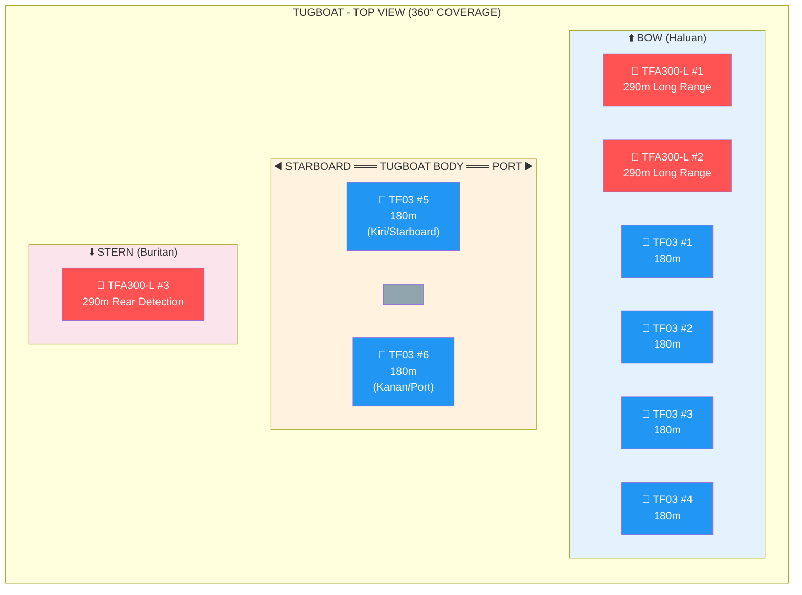
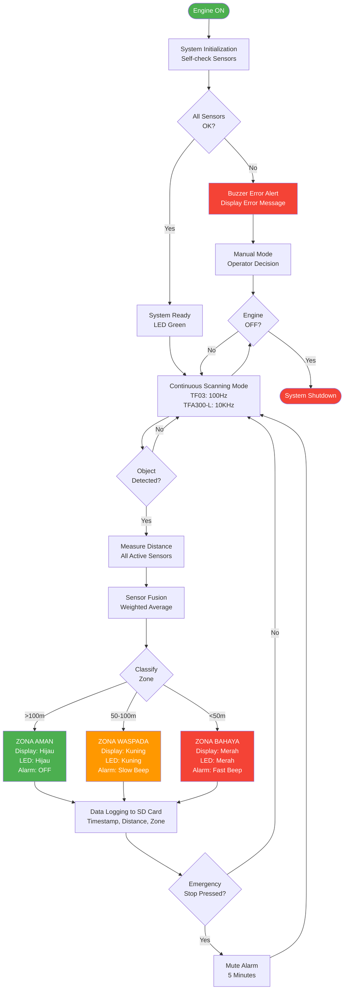
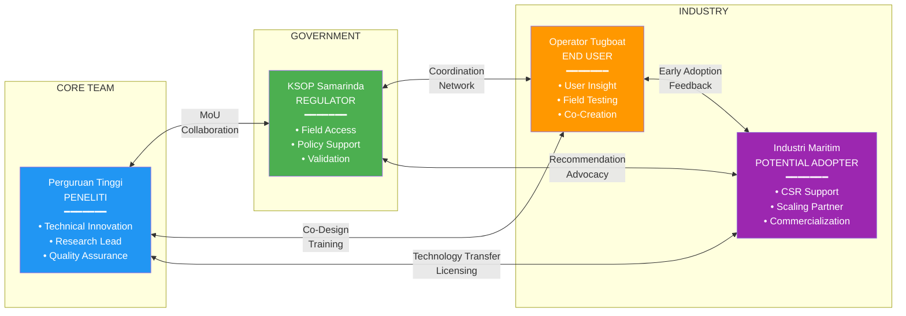
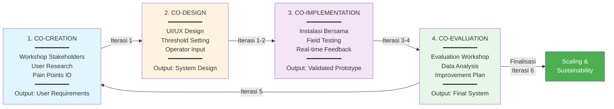

# PROPOSAL PENELITIAN BESTARI SAINTEK

## PENGEMBANGAN SISTEM SENSOR LiDAR ANTI-COLLISION UNTUK KESELAMATAN NAVIGASI TUGBOAT DI SUNGAI MAHAKAM SAMARINDA

---

**Program**: BESTARI SAINTEK
**Penyelenggara**: Direktorat Minat Saintek, Kemendikbudristek
**Periode Pendaftaran**: 13 Oktober 2025 - 24 Oktober 2025
**Tahun Pelaksanaan**: 2025
**Durasi Penelitian**: 9 Bulan

**Bidang Riset**:
- ☑ Transportasi
- ☑ Kemaritiman
- ☑ Manufaktur, konstruksi, dan teknologi informasi

**Mitra Utama**: Kantor Syahbandar dan Otoritas Pelabuhan (KSOP) Samarinda, Kalimantan Timur

**Budget Diajukan**: **Rp 289.900.000,-**

---

## DAFTAR ISI

1. [PERNYATAAN PERMASALAHAN](#1-pernyataan-permasalahan) (Maksimal 500 Kata)
2. [TUJUAN/SASARAN PROGRAM](#2-tujuansasaran-program) (500 Kata)
3. [DESAIN PROSES DAN MODEL EKOSISTEM HIDUP](#3-desain-proses-dan-model-ekosistem-hidup)
4. [KERANGKA LOGIS / TEORI PERUBAHAN](#4-kerangka-logis--teori-perubahan)
5. [MEKANISME RENCANA ITERASI](#5-mekanisme-rencana-iterasi)
6. [LEMBAR PENGESAHAN TIM PERISET](#6-lembar-pengesahan-tim-periset)
7. [LAMPIRAN](#7-lampiran)

---

# 1. PERNYATAAN PERMASALAHAN

**Jumlah kata: 428 kata**

Transportasi sungai di Kalimantan Timur, khususnya Sungai Mahakam, menghadapi tantangan keselamatan navigasi yang serius. Dalam tiga tahun terakhir, KSOP Samarinda mencatat rata-rata 15-20 insiden tabrakan dan 30-40 kejadian nyaris tabrakan per tahun yang melibatkan tugboat dan kapal tongkang. Insiden ini menyebabkan kerugian ekonomi miliaran rupiah, mengancam keselamatan jiwa awak kapal, dan mengganggu kelancaran logistik regional yang vital bagi perekonomian Kalimantan Timur.

Akar permasalahan terletak pada kombinasi faktor teknis dan operasional yang kompleks. Pertama, kondisi geografis Sungai Mahakam yang menantang dengan lebar bervariasi 200-500 meter, banyak tikungan tajam, arus kuat mencapai 3-5 knot, serta sedimentasi yang menyebabkan kedalaman tidak merata. Kedua, keterbatasan visibilitas ekstrem akibat kabut pagi hari yang mengurangi jarak pandang hingga di bawah 50 meter, operasional malam hari dengan minim lampu navigasi, dan hujan deras pada musim penghujan. Ketiga, traffic density tinggi di area pelabuhan Samarinda dan titik strategis lainnya, dengan 10-15 tugboat dapat melintas dalam waktu berdekatan di sungai yang relatif sempit.

Yang paling kritis adalah **ketiadaan sistem deteksi objek otomatis** pada mayoritas tugboat yang beroperasi di Sungai Mahakam. Sekitar 70% tugboat, terutama milik operator skala kecil dan menengah, hanya dilengkapi GPS dan kompas magnetik konvensional tanpa AIS, radar, atau sensor jarak canggih. Nahkoda sepenuhnya bergantung pada visual judgment dan pengalaman pribadi untuk mendeteksi kapal lain atau objek berbahaya, yang sangat tidak reliable dalam kondisi visibilitas rendah. Reaction time manusia yang mencapai 1-2 detik pada kecepatan 6-8 knot setara dengan jarak 3-8 meter, seringkali sudah terlambat untuk menghindari tabrakan.

Solusi teknologi yang ada seperti radar maritim memiliki kendala signifikan. Harga radar berkisar Rp 50-150 juta per unit, memerlukan instalasi dan kalibrasi oleh tenaga ahli, serta biaya maintenance tinggi, menjadikannya tidak feasible untuk mayoritas operator tugboat lokal dengan margin keuntungan yang tipis. AIS memerlukan bahwa semua kapal dilengkapi dengan perangkat yang sama, yang realitasnya tidak terjadi di Sungai Mahakam.

Di sisi lain, teknologi sensor LiDAR telah berkembang pesat dengan harga yang semakin terjangkau dan performa yang terus meningkat. LiDAR menawarkan akurasi tinggi (±10 cm), response time sangat cepat (<0,1 detik), dan jarak deteksi hingga 180-290 meter, memenuhi kebutuhan teknis untuk early warning system pada tugboat. Namun, aplikasi LiDAR untuk keselamatan navigasi tugboat sungai di Indonesia **masih sangat jarang diteliti**, dengan gap riset signifikan dalam hal adaptasi teknologi terhadap kondisi operasional spesifik Indonesia seperti high humidity, water spray, vibration, dan keterbatasan skill operator.

Penelitian ini hadir untuk menjawab gap tersebut dengan mengembangkan sistem sensor LiDAR anti-collision yang tidak hanya secara teknis capable, tetapi juga **contextually appropriate** untuk operator tugboat lokal — affordable, easy to use, reliable dalam kondisi ekstrem Sungai Mahakam, dan didukung oleh ekosistem stakeholder yang memastikan keberlanjutan jangka panjang.

---

# 2. TUJUAN/SASARAN PROGRAM

**Jumlah kata: 500 kata**

## 2.1 Tujuan Penelitian

Tujuan umum penelitian ini adalah **mengembangkan dan memvalidasi sistem sensor LiDAR anti-collision untuk meningkatkan keselamatan navigasi tugboat di Sungai Mahakam Samarinda** melalui pendekatan Living Lab yang melibatkan kolaborasi aktif antara peneliti, KSOP Samarinda, dan operator tugboat.

Tujuan khusus penelitian meliputi:

1. **Merancang dan membangun prototype sistem sensor LiDAR anti-collision** yang mampu mendeteksi objek atau kapal lain dengan jarak efektif 180-290 meter, akurasi ±10 cm, dan response time kurang dari 0,1 detik.

2. **Mengembangkan algoritma deteksi objek dan decision logic** yang dapat mengklasifikasikan zona bahaya (aman, waspada, bahaya) dan memberikan early warning melalui display visual dan alarm audio bertingkat dengan tingkat false alarm di bawah 5%.

3. **Melakukan validasi lapangan** sistem dalam kondisi operasional nyata di Sungai Mahakam dengan minimal 100 jam operational data untuk mengukur performa teknis (akurasi, response time, system uptime) dan user acceptance.

4. **Membangun ekosistem Living Lab** yang sustainable dengan melibatkan KSOP Samarinda, operator tugboat, dan industri maritim dalam proses co-creation, co-design, co-implementation, dan co-evaluation.

5. **Menghasilkan knowledge contribution** melalui publikasi ilmiah, pelatihan operator, dan rekomendasi kebijakan keselamatan maritim sungai kepada otoritas terkait.

## 2.2 Sasaran Program

Sasaran konkret yang ingin dicapai dalam periode penelitian 9 bulan:

**Sasaran Teknis:**
- Menghasilkan **1 prototype sistem lengkap** dengan konfigurasi 10 sensor LiDAR (8 unit TF03 + 3 unit TFA300-L) untuk coverage 360 derajat dengan density tinggi pada bagian depan kapal
- Detection accuracy ≥95% dalam berbagai kondisi visibilitas (kabut, hujan, malam hari)
- False positive rate <5% melalui algoritma filtering dan sensor fusion
- System uptime ≥98% dengan battery life minimal 10 jam operasional
- Waterproof rating IP67 untuk ketahanan terhadap water spray dan high humidity

**Sasaran Operasional:**
- Instalasi dan field testing pada minimal 1 tugboat pilot di Sungai Mahakam
- Pengumpulan minimal 100 jam operational data untuk analisis performa
- Training 20 operator tugboat dengan post-test score minimal 80/100
- User satisfaction score ≥8/10 dari operator yang menggunakan sistem

**Sasaran Kolaborasi:**
- Penandatanganan MoU dengan KSOP Samarinda sebagai mitra utama
- Pembentukan steering committee dengan representasi dari peneliti, KSOP, dan operator tugboat
- Pelaksanaan minimal 4 workshop co-creation dengan stakeholders

**Sasaran Diseminasi:**
- Submission 1 artikel jurnal ke jurnal nasional terakreditasi (Sinta 2/3) atau jurnal internasional
- Presentasi hasil penelitian di seminar nasional atau internasional
- Seminar hasil penelitian untuk stakeholders dan public dengan minimal 50 peserta
- Dokumentasi lengkap (installation manual, user manual, maintenance guide) dalam Bahasa Indonesia

## 2.3 Luaran yang Diharapkan

**Luaran Wajib:**
1. Prototype fungsional sistem sensor LiDAR anti-collision (1 unit lengkap dengan 10 sensor)
2. Laporan akhir penelitian komprehensif untuk BESTARI SAINTEK
3. Artikel ilmiah submitted ke jurnal nasional terakreditasi atau internasional
4. Training module dan sertifikat pelatihan untuk 20 operator tugboat

**Luaran Tambahan:**
1. Hak Kekayaan Intelektual (HKI): Paten sederhana atau desain industri (jika memenuhi kriteria)
2. Rekomendasi kebijakan keselamatan maritim sungai dari KSOP Samarinda
3. Media coverage dan press release untuk public awareness
4. Pathway untuk commercialization atau technology licensing kepada vendor maritime technology

**Dampak Jangka Panjang yang Diharapkan:**
- Pengurangan near-miss incidents sebesar 40% pada tahun pertama implementasi
- Pengurangan actual collision incidents sebesar 30% dalam 2-3 tahun
- Peningkatan operator confidence level sebesar 50% (self-reported)
- Replikasi sistem ke minimal 10 tugboat tambahan dalam 2 tahun setelah penelitian
- Adopsi sistem sebagai standar rekomendasi KSOP untuk tugboat baru di Sungai Mahakam

**Potensi Ekonomi dan Komersialisasi:**
Penelitian ini dirancang dengan pathway komersialisasi yang jelas, membuka peluang technology licensing kepada vendor maritime technology atau pembentukan spin-off company yang dapat melayani pasar nasional. Dengan estimasi 500+ tugboat beroperasi di sungai-sungai besar Indonesia, potensi pasar mencapai nilai ekonomi signifikan sekaligus menciptakan lapangan kerja di sektor teknologi maritim domestik. Kolaborasi erat dengan KSOP dan operator sejak awal memastikan produk final yang market-ready dan sesuai kebutuhan industri.

---

# 3. DESAIN PROSES DAN MODEL EKOSISTEM HIDUP

## 3.1 Arsitektur Sistem

Sistem sensor LiDAR anti-collision dirancang dengan arsitektur **three-layer** yang modular dan scalable:

### Diagram Arsitektur Sistem

```mermaid
graph TB
    subgraph Layer1["Layer 1: Sensor Input"]
        TF03_1[TF03 Sensor 1<br/>180m Range]
        TF03_2[TF03 Sensor 2<br/>180m Range]
        TF03_3[TF03 Sensor 3-8<br/>180m Range]
        TFA_1[TFA300-L Sensor 1-2<br/>290m Long Range]
        TFA_2[TFA300-L Sensor 3<br/>290m Rear]
    end

    subgraph Layer2["Layer 2: Processing Unit"]
        ARD1[Arduino Mega 1<br/>Data Acquisition]
        ARD2[Arduino Mega 2<br/>Data Acquisition]
        ARD3[Arduino Mega 3<br/>Data Acquisition]
        RPI[Raspberry Pi 4<br/>Master Controller<br/>Sensor Fusion]
        SD[SD Card 64GB<br/>Data Logger]
    end

    subgraph Layer3["Layer 3: Output/Interface"]
        LCD[LCD 7" Touchscreen<br/>Real-time Display]
        LED[LED Indicator<br/>RGB Array]
        ALARM[Audio Alarm<br/>Multi-tone Buzzer]
        ESTOP[Emergency Stop<br/>Button]
    end

    subgraph Power["Power System"]
        BOAT[Tugboat 12V DC<br/>Primary Power]
        BATT[Lithium Battery<br/>12V 20Ah Backup]
        CONV[DC-DC Converter<br/>12V to 5V/3.3V]
    end

    TF03_1 --> ARD1
    TF03_2 --> ARD1
    TF03_3 --> ARD2
    TFA_1 --> ARD2
    TFA_2 --> ARD3

    ARD1 --> RPI
    ARD2 --> RPI
    ARD3 --> RPI

    RPI --> SD
    RPI --> LCD
    RPI --> LED
    RPI --> ALARM
    ESTOP --> RPI

    BOAT --> CONV
    BATT --> CONV
    CONV --> ARD1
    CONV --> ARD2
    CONV --> ARD3
    CONV --> RPI

    style Layer1 fill:#e1f5fe
    style Layer2 fill:#fff3e0
    style Layer3 fill:#f3e5f5
    style Power fill:#e8f5e9
```

### Layer 1: Sensor Input
**Konfigurasi 10 Sensor LiDAR untuk Coverage 360 Derajat:**
- **8 unit TF03 LiDAR** (Range 180m, Frame Rate 100Hz, IP67):
  - 4 unit di bagian depan (bow) dengan sudut melebar untuk wide coverage
  - 2 unit di sisi kanan dan kiri (starboard & port) untuk side detection
  - 2 unit di sudut depan kanan dan kiri untuk blind spot coverage

- **3 unit TFA300-L LiDAR** (Range 290m, Frame Rate 10KHz, Ultra-light):
  - 2 unit di center depan untuk long-range early warning
  - 1 unit di belakang (stern) untuk rear object detection

### Diagram Top View: Konfigurasi 10 Sensor LiDAR pada Tugboat



**Keterangan Diagram:**
- 🔴 **TFA300-L (3 unit)**: Sensor long-range 290m untuk early warning
  - **#1 & #2**: Posisi center bow untuk mendeteksi kapal dari jarak jauh
  - **#3**: Posisi stern untuk mendeteksi kapal yang mendekat dari belakang

- 🔵 **TF03 (8 unit)**: Sensor standard-range 180m untuk wide coverage
  - **#1-#4**: Posisi bow dengan sudut melebar untuk coverage depan 180°
  - **#5 & #6**: Posisi starboard/port untuk deteksi samping
  - **#7 & #8**: Posisi sudut depan kiri/kanan (tidak ditampilkan) untuk blind spot coverage

**Total Coverage**: 360 derajat dengan density tinggi di bagian depan (area kritis collision avoidance)

Sensor mounting menggunakan **stainless steel adjustable bracket** dengan vibration damper untuk mengurangi getaran mesin. Enclosure IP67 waterproof melindungi sensor dari water spray dan high humidity.

### Layer 2: Processing Unit
**Master Controller**: Raspberry Pi 4 (8GB RAM) untuk sensor fusion dan decision making
**Sensor Interface**: 3 unit Arduino Mega 2560 untuk data acquisition dari multiple sensors via UART/CAN
**Storage**: SD Card 64GB high-speed untuk data logging dengan timestamp

**Algoritma Processing:**
1. **Data Acquisition Module**: Komunikasi UART/CAN, parsing data frame, validasi data
2. **Signal Processing**: Moving average filter, Kalman filter untuk noise reduction, outlier detection
3. **Sensor Fusion**: Weighted average dari multiple sensors untuk meningkatkan reliability
4. **Decision Logic Engine**:
   - Zona Aman (>100m): LED hijau, no alarm
   - Zona Waspada (50-100m): LED kuning, slow beep
   - Zona Bahaya (<50m): LED merah, fast continuous beep
5. **Data Logger**: Recording timestamp, distance, zone classification untuk analisis post-operation

### Layer 3: Output/Interface
- **LCD Touchscreen 7" Waterproof**: Menampilkan jarak real-time, status zona, grafik trend
- **LED Indicator Array**: RGB LED dengan color-coding (green/yellow/red) untuk quick visual feedback
- **Audio Alarm System**: Multi-tone buzzer dengan graduated warning (slow beep → fast beep → continuous alarm)
- **Emergency Stop Button**: Marine-grade button untuk temporary mute jika terjadi false alarm

### Power System
- **Primary Power**: DC 12V dari sistem kelistrikan tugboat dengan DC-DC converter
- **Backup Battery**: Lithium Battery 12V 20Ah Deep Cycle dengan BMS untuk autonomy minimal 10 jam
- **Protection**: Fuse panel dan voltage regulator untuk melindungi dari power fluctuation

## 3.2 Proses Operasional

Sistem beroperasi secara otomatis dengan flow sebagai berikut:

### Diagram Flowchart Proses Operasional



1. **System Initialization** (Engine ON):
   - Self-check sensor connectivity dan functionality
   - Jika sensor error → Buzzer error alert, display error message
   - Jika sensor OK → System ready, LED indicator green

2. **Continuous Scanning Mode**:
   - TF03 sensors scan pada 100Hz, TFA300-L pada 10KHz
   - Data realtime diproses oleh Raspberry Pi
   - Jarak objek terdekat ditampilkan di LCD (update setiap 0.1 detik)

3. **Object Detection & Classification**:
   - Jika objek terdeteksi → Measure distance → Classify zone
   - **Zona Aman** (>100m): Display hijau "AMAN - Jarak XXX meter", LED hijau, no alarm
   - **Zona Waspada** (50-100m): Display kuning "WASPADA - Jarak XXX meter", LED kuning, slow beep (1x per 2 detik)
   - **Zona Bahaya** (<50m): Display merah "BAHAYA - Jarak XXX meter", LED merah, fast continuous beep

4. **Data Logging**:
   - Setiap detection event dicatat ke SD card: [timestamp, distance, zone, sensor_ID, GPS_coordinate]
   - Data dapat didownload untuk analisis post-operation

5. **Continuous Loop**:
   - Sistem kembali ke scanning mode
   - Operasional 24/7 selama engine ON atau sampai battery depleted (jika using backup power)

## 3.3 Model Ekosistem Living Lab

Penelitian ini mengadopsi pendekatan **Living Lab** yang menekankan kolaborasi multi-stakeholder dalam seluruh proses penelitian:

### Diagram Ekosistem Living Lab



### Diagram Living Lab Cycle (4 Fase)



### Stakeholder Mapping

**1. Perguruan Tinggi (Peneliti)**
- **Kontribusi**: Expertise teknologi, fasilitas riset, SDM peneliti dan mahasiswa
- **Manfaat**: Publikasi ilmiah, HKI, pengalaman praktis mahasiswa, networking dengan industri
- **Peran**: Lead development, technical innovation, quality assurance

**2. KSOP Samarinda (Regulator & Fasilitator)**
- **Kontribusi**: Akses lapangan, data kecelakaan, regulasi & standar keselamatan, izin operasional, network dengan operator tugboat
- **Manfaat**: Teknologi untuk monitoring keselamatan, data untuk policy-making, rekomendasi kebijakan berbasis evidence
- **Peran**: Field access facilitator, validator sistem terhadap regulasi, policy advocate

**3. Operator Tugboat (End User)**
- **Kontribusi**: Insight operasional, feedback user real-time, partisipasi uji coba, operational data
- **Manfaat**: Peningkatan keselamatan navigasi, kompetensi teknologi, sertifikat pelatihan, prioritas akses teknologi
- **Peran**: Co-creator (memberikan input kebutuhan), tester (field validation), early adopter

**4. Industri Maritim (Potential Adopter & Investor)**
- **Kontribusi**: Dukungan finansial (optional), akses armada untuk scale-up, business network
- **Manfaat**: Inovasi kompetitif, CSR program, first mover advantage jika komersialisasi
- **Peran**: Observer fase awal, potential partner untuk scaling dan commercialization

### Living Lab Cycle

**1. Co-Creation Phase** (Iterasi 1):
- Workshop dengan stakeholders untuk identifikasi pain points keselamatan navigasi
- User research: interview 10 nahkoda, survey 20 operator, FGD dengan expert KSOP
- Output: User requirement document yang mencerminkan kebutuhan riil

**2. Co-Design Phase** (Iterasi 1-2):
- Melibatkan operator dalam desain user interface (warna, layout, size font, brightness level)
- Diskusi threshold alarm: pada jarak berapa alarm harus berbunyi? Seberapa loud? Pattern beep seperti apa?
- Output: System design yang user-centric dan culturally appropriate

**3. Co-Implementation Phase** (Iterasi 3-4):
- Instalasi sistem bersama operator dan teknisi KSOP
- Uji coba lapangan dengan monitoring real-time dari tim peneliti
- Operator memberikan feedback immediate jika ada issue atau ketidaknyamanan
- Output: Prototype yang validated dalam kondisi operasional nyata

**4. Co-Evaluation Phase** (Iterasi 5):
- Evaluation workshop dengan semua stakeholders
- Review quantitative data (detection accuracy, false alarm rate) dan qualitative feedback (user satisfaction)
- Brainstorming improvement dan prioritization
- Output: Improvement roadmap dan commitment untuk scaling

### Sustainability Model

**Keberlanjutan Teknologi**:
- Maintenance protocol dengan spare parts availability melalui distributor lokal
- Technical support hotline (24/7 emergency contact selama penelitian, transition ke vendor setelahnya)
- Annual calibration service

**Keberlanjutan Finansial**:
- Fase Pilot (Bulan 1-9): Grant funding BESTARI SAINTEK
- Fase Adoption (Bulan 10-24): Cost-sharing dengan operator (operator membayar 50% dari harga)
- Fase Scale-up (Tahun 3+): Full commercialization melalui technology licensing atau spin-off company

**Keberlanjutan Kelembagaan**:
- Pembentukan "Maritime Technology Innovation Hub" di institusi peneliti sebagai center of excellence
- Long-term partnership agreement dengan KSOP Samarinda (5 tahun MoU)
- Community of practice untuk operator tugboat: Forum komunikasi, sharing best practices, continuous learning

---

# 4. KERANGKA LOGIS / TEORI PERUBAHAN

## 4.1 Logic Model Framework

Penelitian ini menggunakan **Logic Model** sebagai kerangka perencanaan dan evaluasi:

```
INPUT → ACTIVITIES → OUTPUT → OUTCOME → IMPACT
```

### INPUT (Sumber Daya)

**A. Sumber Daya Manusia (28 orang):**
- 1 Ketua Tim Peneliti (Full-time 9 bulan)
- 2 Anggota Peneliti (Full-time software engineer, Part-time maritime liaison)
- 2 Asisten Peneliti (Part-time 9 bulan)
- 2 Mahasiswa (Part-time 6 bulan)
- 1 Koordinator KSOP (Advisor 9 bulan)
- 20 Operator Tugboat (On-demand 2 bulan untuk training dan testing)

**B. Sumber Daya Material:**
- 10 Sensor LiDAR (8x TF03 + 3x TFA300-L)
- Processing unit (Raspberry Pi 4, Arduino Mega 2560)
- Display, LED, alarm system
- Power supply dan battery backup
- Enclosure waterproof IP67, mounting bracket stainless steel
- Kabel marine-grade, connector IP68
- 3D Printer Creality K2 PLUS CFS Combo untuk rapid prototyping
- Tools profesional (soldering station, oscilloscope, multimeter, dll)

**C. Sumber Daya Finansial:**
Total Budget: **Rp 289.900.000**

| Kategori | Jumlah (Rp) | Persentase |
|----------|-------------|------------|
| Sensor & Komponen Elektronik (10 Sensor System) | Rp 96.246.000 | 33,2% |
| Bea Cukai & Pajak Impor | Rp 33.173.000 | 11,4% |
| Tools, Equipment & 3D Printing | Rp 44.889.000 | 15,5% |
| Operasional Lapangan & Safety Equipment (K3/PPE) | Rp 65.268.000 | 22,5% |
| Contingency & Miscellaneous | Rp 29.114.000 | 10,0% |
| **TOTAL** | **Rp 289.900.000** | **100%** |

**Catatan Budget:**
- Safety Equipment (PPE/K3) standar industri lengkap: kacamata safety, masker N95, helmet ANSI-certified, life jacket USCG-approved, safety shoes steel toe, fall protection harness, first aid kit maritime, APAR
- Bea Cukai: Bea Masuk (10%), PPN Impor (11%), PPh Pasal 22 Impor (7,5%)
- Contingency fund 10% untuk handling unforeseen expenses
- TIDAK termasuk biaya sewa tugboat (kolaborasi dengan operator lokal melalui Living Lab approach)

**D. Sumber Daya Waktu:**
- Durasi penelitian: 9 bulan
- 6 iterasi Agile development dengan sprint 1-2 bulan per iterasi

### ACTIVITIES (Aktivitas)

**Iterasi 1 (Bulan 1-2): Desain dan Inisiasi**
- Kick-off meeting, alignment, MoU signing dengan KSOP
- User research (interview 10 nahkoda, survey 20 operator)
- System design (hardware architecture, software flowchart, UI/UX mockup)
- Procurement sensor dan material

**Iterasi 2 (Bulan 3-4): Pengembangan Prototype Awal**
- Hardware assembly (sensor integration, microcontroller setup, peripheral integration)
- Software development (~980 lines of code: data acquisition, signal processing, decision logic, display driver, alarm controller, data logger)
- Indoor testing (10 test cases: basic detection, zone classification, response time, display functionality, data logging, continuous operation)

**Iterasi 3 (Bulan 5): Testing dan Kalibrasi**
- Outdoor calibration (distance calibration, reflectivity test, angle calibration, ambient light test)
- Stress testing (durability 24 jam, temperature stress, vibration test, water spray test, EMI test, power fluctuation test)
- Algorithm optimization (moving average filter, Kalman filter, adaptive threshold, sensor fusion)

**Iterasi 4 (Bulan 6-7): Uji Coba Lapangan Fase 1**
- Instalasi sistem pada 1 tugboat pilot di Sungai Mahakam
- Field testing intensif (minimal 100 jam operational data)
- Data collection: automatic log, operator log, interview, video documentation
- Weekly monitoring dan maintenance

**Iterasi 5 (Bulan 8): Evaluasi dan Improvement**
- Evaluation workshop dengan stakeholders
- Gap analysis (target vs actual performance)
- Implementation of improvements (auto-brightness, power-saving mode, hydrophobic coating, improved alarm logic)
- Re-testing dan validation (1 minggu mini field test)

**Iterasi 6 (Bulan 9): Finalisasi dan Diseminasi**
- Finalisasi dokumentasi (installation manual, user manual, maintenance guide, training module, research report)
- Mass training program (20 operator, 2 hari, sertifikasi)
- Publikasi ilmiah (journal submission)
- Stakeholder seminar dan handover ceremony ke KSOP

### OUTPUT (Hasil Langsung)

**Deliverable Teknis:**
- 1 unit prototype sistem sensor LiDAR anti-collision fully functional dengan 10 sensor
- Source code dan firmware lengkap dengan dokumentasi
- Complete documentation package (6 dokumen: installation, user, maintenance, technical spec, training module, research report)

**Deliverable Data:**
- Minimal 100 jam operational data dari field testing
- Field test report komprehensif (40-50 halaman)
- Performance metrics dashboard (accuracy, response time, false positive rate, uptime, user satisfaction)

**Deliverable Capacity Building:**
- 20 operator tugboat terlatih dengan sertifikat kompetensi
- Training module yang dapat direplikasi untuk training masa depan

**Deliverable Publikasi:**
- 1 artikel jurnal submitted (target: Sinta 2/3 atau internasional)
- Seminar hasil penelitian dengan minimal 50 peserta stakeholders
- Media coverage dan press release

**Deliverable Kolaborasi:**
- MoU signed dengan KSOP Samarinda
- Recommendation letter dari KSOP untuk implementasi lanjutan
- Partnership framework untuk scaling dan sustainability

### OUTCOME (Perubahan Jangka Pendek - 1-2 Tahun)

**Technical Outcome:**
- Sistem sensor LiDAR anti-collision terbukti mampu mendeteksi objek dengan **accuracy ≥95%**, **response time ≤0.1 detik**, **false positive rate <5%**, dan **system uptime ≥98%**
- Teknologi terbukti reliable dalam kondisi ekstrem Sungai Mahakam (kabut, hujan, high humidity, vibration)

**Behavioral Outcome:**
- **70% operator yang dilatih** mengadopsi penggunaan sistem secara konsisten dalam operasional daily
- **User satisfaction score ≥8/10** menunjukkan sistem diterima dengan baik oleh end-user
- **Peningkatan operator confidence level +50%** (self-reported) dalam navigasi kondisi visibilitas rendah

**Safety Outcome:**
- **Pengurangan near-miss incidents sebesar 40%** pada tugboat yang equipped dengan sistem (comparative analysis dengan baseline data KSOP)
- **Zero critical system failure** yang membahayakan keselamatan selama periode field testing

**Institutional Outcome:**
- KSOP Samarinda memberikan **rekomendasi resmi** untuk adopsi sistem pada armada tugboat di wilayah kerja mereka
- Terbentuknya **Maritime Technology Innovation Hub** di institusi peneliti sebagai center of excellence untuk riset maritim lanjutan
- **Partnership agreement** jangka panjang antara perguruan tinggi dan KSOP untuk collaborative research berkelanjutan

**Knowledge Outcome:**
- Publikasi ilmiah di jurnal nasional terakreditasi atau internasional yang berkontribusi pada body of knowledge teknologi keselamatan maritim
- Disseminasi hasil penelitian melalui seminar dan media massa meningkatkan public awareness tentang pentingnya teknologi keselamatan navigasi

### IMPACT (Dampak Jangka Panjang - 3-5 Tahun)

**Safety Impact:**
- **Pengurangan actual collision incidents sebesar 30%** di Sungai Mahakam dalam 3 tahun setelah implementasi massal (target: 20+ tugboat equipped)
- **Pengurangan fatality rate** terkait kecelakaan navigasi tugboat
- **Pengurangan kerugian ekonomi** akibat kecelakaan (material damage, cargo loss, downtime)

**Economic Impact:**
- **Penghematan biaya operasional** operator tugboat melalui pengurangan kecelakaan dan downtime
- **Peningkatan efisiensi logistik** melalui operasional yang lebih aman dan reliable
- **Penciptaan nilai ekonomi baru** melalui commercialization teknologi (technology licensing, spin-off company) yang dapat menciptakan lapangan kerja di sektor teknologi maritim

**Environmental Impact:**
- **Pengurangan risiko tumpahan muatan** (batubara, CPO) ke Sungai Mahakam yang dapat mencemari lingkungan
- **Perlindungan ekosistem sungai** melalui navigasi yang lebih aman dan terkontrol

**Policy Impact:**
- **Adopsi sistem sebagai standar rekomendasi KSOP** untuk tugboat baru atau renovasi di Sungai Mahakam
- **Replikasi regulasi** ke KSOP lain di Indonesia untuk sungai-sungai besar (Kapuas, Barito, Musi)
- **Policy advocacy** untuk mandatory anti-collision system pada tugboat di Indonesia (long-term vision)

**Technological Impact:**
- **Model replikasi** teknologi LiDAR anti-collision ke aplikasi maritim lainnya (kapal penumpang sungai, ferry, kapal patroli)
- **Technology transfer** ke industri maritim lokal melalui licensing atau partnership
- **Peningkatan kapasitas inovasi** institusi peneliti dalam R&D teknologi maritim

**Social Impact:**
- **Peningkatan keselamatan dan quality of life** awak kapal tugboat (reduced stress, fatigue dari worry tentang collision)
- **Peningkatan kepercayaan public** terhadap keselamatan transportasi sungai
- **Role model** kolaborasi multi-stakeholder (academia-government-industry) untuk menyelesaikan masalah sosial melalui inovasi teknologi

## 4.2 Teori Perubahan (Theory of Change) Pathway

Teori Perubahan penelitian ini menggambarkan pathway logis dari input menuju impact:

**IF** kita mengembangkan sistem sensor LiDAR anti-collision yang accurate, reliable, affordable, dan user-friendly
**AND** kita melibatkan KSOP dan operator tugboat sejak awal dalam proses co-creation
**AND** kita melakukan field validation dalam kondisi operasional nyata
**AND** kita memberikan training komprehensif kepada operator
**THEN** operator akan mengadopsi sistem dalam operasional daily mereka
**BECAUSE** mereka merasakan manfaat langsung (early warning, increased confidence, reduced stress)
**LEADING TO** pengurangan near-miss dan collision incidents
**RESULTING IN** peningkatan keselamatan transportasi sungai secara keseluruhan
**AND** pengurangan kerugian ekonomi dan environmental damage
**ULTIMATELY CONTRIBUTING TO** transportasi sungai yang lebih aman, efisien, dan sustainable di Indonesia

**Asumsi Kritis:**
1. Operator tugboat willing to learn dan adopt teknologi baru (mitigasi: incentive, demonstration manfaat nyata, training intensif)
2. KSOP committed untuk mendukung implementasi jangka panjang (mitigasi: MoU, clear benefit untuk KSOP dalam monitoring dan policy-making)
3. Sensor LiDAR reliable dalam kondisi ekstrem Sungai Mahakam (mitigasi: extensive stress testing, waterproof enclosure IP67, vibration damper)
4. Funding tersedia untuk scaling setelah fase pilot (mitigasi: pathway commercialization, seek CSR funding, demonstrate ROI yang jelas)

## 4.3 Indikator Keberhasilan

**Indikator Proses:**
- MoU signed dengan KSOP Samarinda (Target: Bulan 1)
- User requirement document approved oleh minimal 3 operator senior (Target: Bulan 2)
- Prototype hardware fully assembled dan functioning (Target: Bulan 4)
- Field testing dimulai on-schedule (Target: Bulan 6)
- 20 operator trained dengan post-test score ≥80/100 (Target: Bulan 9)

**Indikator Output:**
- 1 unit prototype sistem lengkap dengan 10 sensor LiDAR delivered (Target: Bulan 9)
- Complete documentation package (6 dokumen) finalized (Target: Bulan 9)
- Minimal 100 jam operational data terkumpul (Target: Bulan 7)
- 1 artikel jurnal submitted (Target: Bulan 9)

**Indikator Outcome:**
- Detection accuracy ≥95% (Measurement: field test data analysis)
- Response time ≤0.1 detik (Measurement: automatic data log)
- False positive rate <5% (Measurement: operator log + automatic log cross-verification)
- System uptime ≥98% (Measurement: automatic log)
- User satisfaction score ≥8/10 (Measurement: survey)
- Operator confidence level increase +50% (Measurement: pre-post survey)
- Near-miss incidents reduction target -40% (Measurement: KSOP incident report comparative analysis)

**Indikator Impact (Long-term):**
- Actual collision reduction -30% dalam 3 tahun (Measurement: KSOP incident report)
- Minimal 10 tugboat additional equipped dalam 2 tahun setelah penelitian (Measurement: deployment tracking)
- KSOP recommendation letter obtained (Measurement: official document)
- Technology commercialization initiated (Measurement: licensing agreement atau spin-off company established)

---

# 5. MEKANISME RENCANA ITERASI

## 5.1 Overview Agile Development

Penelitian ini mengadopsi **Agile Development Methodology** dengan 6 sprint/iterasi utama yang memungkinkan **continuous improvement** berdasarkan feedback dan evaluasi di setiap fase.

**Prinsip Agile:**
1. **Iterative Progress**: Pengembangan bertahap dengan evaluasi berkala
2. **User-Centric**: Melibatkan operator tugboat sejak awal sebagai co-creator
3. **Fail Fast, Learn Fast**: Identifikasi masalah sedini mungkin untuk perbaikan cepat
4. **Flexible but Focused**: Adaptif terhadap feedback namun tetap pada tujuan utama
5. **Collaborative**: Kerja sama erat antara peneliti, KSOP, dan operator

## 5.2 Timeline 6 Iterasi (9 Bulan)

```
BULAN:  1      2      3      4      5      6      7      8      9
        │      │      │      │      │      │      │      │      │
        ├──────┼──────┼──────┼──────┼──────┼──────┼──────┼──────┤
ITERASI:│  I1  │      │  I2  │      │  I3  │  I4  │      │  I5  │ I6
        │      │      │      │      │      │      │      │      │
FASE:   │ Persiapan  │  Development │ Test │ Field Trial│ Eval │Fin
        └──────┴──────┴──────┴──────┴──────┴──────┴──────┴──────┘
```

**Iterasi 1 (Bulan 1-2): Desain dan Inisiasi**
- Sprint Goal: Membangun fondasi proyek melalui user research, system design, dan procurement
- Aktivitas Utama:
  - Kick-off meeting dan MoU signing dengan KSOP Samarinda
  - User research: interview 10 nahkoda, survey 20 operator, FGD dengan KSOP
  - System design (hardware architecture, software flowchart, UI/UX mockup, mounting system)
  - Procurement semua material dan sensor
- Deliverables:
  - MoU signed dengan KSOP Samarinda
  - User Requirement Document (15-20 hal)
  - System Design Document (25-30 hal)
  - Bill of Materials (BoM) Complete
  - All materials arrived & verified
- Success Criteria:
  - 100% material arrived on-time dan verified kualitas
  - System design approved by expert reviewer external
  - User requirement document approved oleh minimal 3 operator senior

**Iterasi 2 (Bulan 3-4): Pengembangan Prototype Awal**
- Sprint Goal: Membangun prototype v1.0 (MVP) yang fungsional untuk indoor testing
- Aktivitas Utama:
  - Hardware assembly (sensor integration, microcontroller setup, peripheral integration, power system)
  - Software development (~980 lines of code: data acquisition, signal processing, decision logic, display driver, alarm controller, data logger, main program)
  - Indoor testing (10 test cases: basic detection, blind zone, zone classification, response time, display functionality, audio alert, data logging, power consumption, continuous operation 8 jam, multi-reflectivity)
  - Integration & optimization (dual sensor fusion, code optimization, casing & packaging)
- Deliverables:
  - Prototype Hardware v1.0 (1 unit sistem dengan 10 sensor assembled)
  - Source Code & Firmware complete dengan dokumentasi
  - Indoor Test Report (hasil semua test cases)
  - Bug List & Resolution (critical bugs = 0)
  - User Manual Draft v0.1
- Success Criteria:
  - Sensor dapat detect objek dengan akurasi ±10cm (sesuai spek)
  - Response time ≤0.1 detik
  - Display & alarm berfungsi dengan baik
  - Data logging berfungsi tanpa error
  - System dapat beroperasi kontinyu minimal 8 jam tanpa crash
  - Zero critical bugs

**Iterasi 3 (Bulan 5): Testing dan Kalibrasi**
- Sprint Goal: Mencapai performa optimal melalui kalibrasi presisi dan stress testing
- Aktivitas Utama:
  - Outdoor calibration (distance calibration 1-180m, reflectivity test 90%/50%/10%, angle calibration 0°-45°, ambient light test full sunlight-night)
  - Stress testing (durability 24 jam, temperature stress 35°C/15°C, vibration test, water spray IP67 test, EMI test, power fluctuation 10V-14V)
  - Algorithm optimization (moving average filter, Kalman filter, adaptive threshold, sleep mode, sensor fusion weighted average)
  - A/B testing (before vs after optimization)
- Deliverables:
  - Calibration Certificate (calibration data, correction factors, validity period)
  - Stress Test Report (all test results, failure analysis, corrective actions)
  - Prototype v1.5 (Optimized) dengan firmware updated
  - Performance Metrics Dashboard
- Success Criteria:
  - Calibration error <5% untuk range 1-100m
  - All stress tests passed tanpa critical failure
  - False positive rate <5%
  - Response time ≤0.1 detik (target: 0.05 detik)
  - Battery life ≥10 jam operasional
  - System reliability >95%

**Iterasi 4 (Bulan 6-7): Uji Coba Lapangan Fase 1**
- Sprint Goal: Validasi performa dalam kondisi operasional nyata dan mengumpulkan data lapangan
- Aktivitas Utama:
  - Instalasi sistem pada 1 tugboat pilot di Sungai Mahakam (2 hari instalasi & commissioning)
  - Field operation & monitoring:
    - Week 1: Intensive on-site monitoring (tim naik tugboat setiap hari)
    - Week 2-3: Semi-intensive monitoring (3x per minggu, remote monitoring via data log)
    - Week 4-5: Remote monitoring (1x site visit, operator report via WhatsApp)
  - Data collection:
    - Automatic log data (timestamp, distance, zone, alarm status) - kontinyu
    - Operator log manual (incident, false alarm, system issue) - daily
    - Interview semi-structured - weekly
    - Video documentation - 2-3 trip per week
  - Data analysis & documentation (data cleaning, statistical analysis, visualization, qualitative analysis thematic coding)
- Deliverables:
  - Field Test Report (40-50 hal)
  - Data Log Raw Data (CSV files, minimal 100 jam operational data)
  - Interview Transcripts (15-20 hal)
  - Video Documentation (2-3 jam total)
  - Issue Tracker & Resolution Log
  - Operator Feedback Summary (5-7 hal)
- Success Criteria:
  - System uptime >95% selama periode field test
  - True positive rate >90%
  - False positive rate <5%
  - Operator satisfaction score >7/10
  - Zero critical system failure yang membahayakan keselamatan
  - Minimal 100 jam operational data terkumpul
  - Minimal 50 detection events recorded

**Iterasi 5 (Bulan 8): Evaluasi dan Improvement**
- Sprint Goal: Menganalisis hasil field test dan mengimplementasikan improvement final
- Aktivitas Utama:
  - Comprehensive evaluation workshop (2 hari intensive) dengan stakeholders:
    - Session 1: Quantitative results presentation
    - Session 2: Operator experience sharing (FGD)
    - Session 3: Technical issues deep dive (root cause analysis)
    - Session 4: Brainstorming improvement (design thinking)
    - Session 5: Prioritization & roadmap (MoSCoW method)
  - Gap analysis (target vs actual performance)
  - Implementation of improvements:
    - MUST: Auto-brightness display (PWM-based, ambient light sensor)
    - MUST: Power-saving mode (MCU sleep when zona aman)
    - MUST: Hydrophobic coating pada sensor lens (nano-coating)
    - SHOULD: Improved alarm logic (graduated warning)
    - SHOULD: Add mute button untuk false alarm (temporary 5 min mute)
  - Re-testing & validation (1 minggu mini field test)
  - Comparative analysis before-after improvement
- Deliverables:
  - Evaluation Report (comprehensive analysis, gap analysis, improvement roadmap)
  - Prototype v2.0 (Final) dengan all improvements implemented
  - Improvement Validation Report (comparative before-after)
  - Updated Source Code (firmware final version)
- Success Criteria:
  - False positive rate <5%
  - User satisfaction >8/10
  - Battery life >10 jam
  - All "MUST" improvements implemented dan validated
  - Zero critical bugs remaining

**Iterasi 6 (Bulan 9): Finalisasi dan Diseminasi**
- Sprint Goal: Menyelesaikan dokumentasi, pelatihan massal, publikasi, dan handover
- Aktivitas Utama:
  - Documentation finalization:
    - Installation Manual (15 hal)
    - User Manual (20 hal)
    - Maintenance Guide (12 hal)
    - Technical Specification (10 hal)
    - Training Module (25 hal)
    - Research Report Final (60 hal)
    - Internal review → External review KSOP → Operator review → Revisi → Final approval
  - Mass training program:
    - Duration: 2 hari (16 jam total)
    - Participants: 20 operator tugboat
    - Format: 40% teori, 60% praktik hands-on
    - Pre-test, post-test (target score ≥80/100), training satisfaction survey
    - Certification ceremony
  - Publication & dissemination:
    - Journal article submission (target: Sinta 2/3 atau international journal)
    - Conference paper submission (optional)
    - Stakeholder seminar (50+ participants: KSOP, operator, industri maritim, media, akademisi)
    - Handover ceremony: Serah terima prototype ke KSOP dengan BAST (Berita Acara Serah Terima)
- Deliverables:
  - Complete Documentation Package (6 documents) - Printed + PDF
  - 1 unit Prototype Final (v2.0) dengan full accessories
  - Training Certificate (20 pcs) untuk trained operators
  - Training Report
  - Journal/Conference Paper (submitted)
  - Final Research Report (untuk BESTARI SAINTEK)
  - KSOP Recommendation Letter
- Success Criteria:
  - All documentation completed dan approved
  - 20 operator trained dengan post-test score >80/100
  - 1 unit prototype handed over to KSOP dengan BAST
  - Journal paper submitted (accepted: bonus, tidak mandatory untuk project complete)
  - Final report submitted to BESTARI SAINTEK
  - KSOP recommendation letter obtained
  - Stakeholder seminar executed successfully (≥50 participants)

## 5.3 Monitoring & Control Mechanism

**Project Tracking Tools:**
- **Gantt Chart**: Timeline tracking, milestone management (Update: Weekly)
- **Issue Tracker**: Bug tracking, task assignment (Update: Daily)
- **Sprint Board**: Visual task progress - To Do, In Progress, Done (Update: Daily)
- **Budget Tracker**: Financial monitoring (Update: Bi-weekly)
- **Risk Register**: Risk identification & mitigation (Update: Bi-weekly)

**Regular Meetings:**
- **Daily Stand-up** (Senin-Jumat, 15 menit): Yesterday, Today, Blockers
- **Sprint Review** (End of each iteration, 2 jam): Demo, Feedback, Approval dengan KSOP dan operator pilot
- **Sprint Retrospective** (End of each iteration, 1 jam, internal team only): What went well, What to improve
- **Stakeholder Meeting** (Monthly, 1 jam): Progress update, Issues, Next steps

**Risk Management:**
- Review risk register setiap 2 minggu
- Identify new risks yang muncul
- Update mitigation strategy based on effectiveness
- Escalation protocol berdasarkan severity (Critical <4 jam, High <24 jam, Medium 2-3 days, Low 1 week)

---

# 6. TIM PENELITI DAN MITRA

## 6.1 Struktur Tim Peneliti

**Total Anggota Tim**: 7 orang + 20 operator tugboat (participants)

### Ketua Tim Peneliti
- **Peran**: Koordinator dan penanggung jawab keseluruhan proyek, desain arsitektur sistem hardware dan software, supervisi pengembangan prototype, koordinasi dengan KSOP Samarinda, penyusunan laporan akhir dan publikasi ilmiah
- **Komitmen Waktu**: Full-time (9 bulan)
- **Bidang Keahlian**: Sistem Embedded & Mikrokontroler, Sensor dan Instrumentasi, Internet of Things (IoT)

### Anggota Peneliti 1 (Software Engineer)
- **Peran**: Pengembangan firmware dan software sistem, implementasi algoritma deteksi dan decision logic, optimasi performa sistem (response time, accuracy), testing dan debugging software, dokumentasi teknis (source code documentation)
- **Komitmen Waktu**: Full-time (9 bulan)
- **Bidang Keahlian**: Software Engineering, Algorithm Development, Data Processing & Analysis

### Anggota Peneliti 2 (Maritime Liaison)
- **Peran**: Koordinator uji coba lapangan, liaison dengan operator tugboat dan KSOP, analisis kondisi operasional dan user requirement, pengumpulan dan analisis data lapangan, penyusunan training module untuk operator
- **Komitmen Waktu**: Part-time (6 bulan, intensive pada fase field testing)
- **Bidang Keahlian**: Teknik Navigasi & Sistem Maritim, Marine Safety Engineering

### Asisten Peneliti / Mahasiswa 1
- **Peran**: Asisten teknis assembly hardware, data collection dan data entry, testing support (lab testing dan field testing), dokumentasi foto/video kegiatan penelitian, administrasi penelitian
- **Komitmen Waktu**: Part-time (9 bulan)
- **Jenjang**: S1 / S2 (Teknik Elektro / Teknik Komputer)

### Asisten Peneliti / Mahasiswa 2
- **Peran**: Asisten software development, data analysis dan visualisasi, testing dan quality assurance, penyusunan user manual dan dokumentasi, administrasi penelitian
- **Komitmen Waktu**: Part-time (9 bulan)
- **Jenjang**: S1 / S2 (Teknik Informatika / Sistem Informasi)

## 6.2 Mitra Penelitian

### A. INSTITUSI MITRA UTAMA

**Nama Institusi**: Kantor Syahbandar dan Otoritas Pelabuhan (KSOP) Samarinda

**Alamat**: [Akan dilengkapi sesuai data resmi KSOP Samarinda]
Kota Samarinda, Provinsi Kalimantan Timur

**Status**: Instansi Pemerintah di bawah Direktorat Jenderal Perhubungan Laut, Kementerian Perhubungan Republik Indonesia

### B. KONTRIBUSI MITRA DALAM PENELITIAN

**1. Akses Lapangan:**
- Izin operasional uji coba di Sungai Mahakam
- Akses ke pelabuhan dan dermaga tugboat
- Fasilitas koordinasi dengan operator tugboat di wilayah kerja KSOP

**2. Data dan Informasi:**
- Data historis kecelakaan navigasi (collision, near-miss incidents) 3 tahun terakhir (2022-2024)
- Regulasi dan standar keselamatan maritim sungai
- Peta jalur navigasi dan identifikasi area high-risk di Sungai Mahakam

**3. Validasi dan Verifikasi:**
- Validasi kelayakan sistem sesuai standar keselamatan maritim
- Review dan approval SOP penggunaan sistem
- Sertifikasi kelayakan operasional (jika diperlukan)

**4. Sosialisasi dan Implementasi:**
- Fasilitasi pelatihan operator tugboat (venue, koordinasi peserta)
- Dukungan sosialisasi hasil penelitian ke stakeholders (industri maritim, pemerintah daerah)
- Rekomendasi untuk implementasi lanjutan dan scaling-up

**5. Dukungan Kelembagaan:**
- Partisipasi dalam steering committee penelitian (monthly meeting)
- Dukungan policy advocacy untuk scaling up dan replikasi ke wilayah lain
- Network dengan industri maritim regional untuk potential commercialization

### C. KOMITMEN JANGKA PANJANG MITRA

Mitra berkomitmen untuk mendukung **sustainability** dan **scaling up** hasil penelitian melalui:
- Rekomendasi adopsi sistem pada armada tugboat di wilayah kerja KSOP Samarinda
- Integrasi sistem ke dalam program keselamatan pelayaran sungai
- Dukungan maintenance dan monitoring jangka panjang (koordinasi dengan operator, troubleshooting support)
- Advokasi kepada Ditjen Perhubungan Laut untuk replikasi ke KSOP lain di Indonesia

### D. OPERATOR TUGBOAT (END USER PARTICIPANTS)

**Jumlah**: 20 operator tugboat (nahkoda dan awak kapal)

**Peran dalam Penelitian:**
- Participants dalam user research (interview, survey, FGD)
- Co-creator dalam proses desain user interface dan threshold setting
- Tester dalam field validation (1 nahkoda pilot untuk intensive field testing, 19 operator lain untuk training dan feedback)
- Recipients training dan sertifikasi kompetensi

**Manfaat bagi Operator:**
- Peningkatan keselamatan navigasi dalam operasional daily
- Kompetensi baru dalam penggunaan teknologi navigasi modern
- Sertifikat pelatihan resmi dari peneliti dan KSOP
- Prioritas akses untuk instalasi sistem pada fase scaling (setelah penelitian)

## 6.3 Mekanisme Kolaborasi Multi-Stakeholder

**Steering Committee:**
- Komposisi: 2 peneliti (Ketua + Anggota), 1 perwakilan KSOP, 1 perwakilan operator tugboat
- Fungsi: Strategic decision making, conflict resolution, progress monitoring
- Frekuensi meeting: Monthly (1 jam)

**Working Group:**
- Komposisi: Seluruh tim peneliti + liaison officer KSOP
- Fungsi: Operational coordination, technical problem solving, day-to-day execution
- Frekuensi meeting: Weekly (1 jam)

**User Feedback Loop:**
- Mekanisme: WhatsApp group dengan operator pilot untuk immediate feedback selama field testing
- Fungsi: Quick issue reporting, real-time troubleshooting, user experience sharing
- Response time: <24 jam untuk non-critical issues, <4 jam untuk critical issues

**Formal Communication:**
- Quarterly report kepada KSOP tentang progress penelitian
- Presentation di KSOP stakeholder meeting (jika diminta)
- Final presentation dan handover ceremony di akhir penelitian

---

# 7. LAMPIRAN

## LAMPIRAN A: SPESIFIKASI TEKNIS SENSOR LiDAR

### A.1 TF03 LiDAR Sensor (Sensor Primer)

**Spesifikasi Lengkap:**

| Parameter | Spesifikasi | Keterangan |
|-----------|-------------|------------|
| **Range** | 0.1m - 180m | @ 90% reflectivity |
| **Accuracy** | ±10cm (<10m) <br> 1% (>10m) | High precision untuk short-medium range |
| **Resolution** | 1 cm | Granularity pengukuran jarak |
| **Frame Rate** | 100Hz (default) | Adjustable 1-1000Hz |
| **Field of View (FOV)** | 0.5° | Narrow beam untuk precise targeting |
| **Wavelength** | 905nm | Near-infrared, invisible to human eye |
| **IP Rating** | IP67 | Waterproof, submersible 1m for 30 min |
| **Operating Voltage** | 5V DC ±5% | Via USB power atau regulated supply |
| **Current Consumption** | <150mA @ 5V | Low power consumption |
| **Operating Temperature** | -20°C to +60°C | Wide temperature range |
| **Interface** | UART, CAN, IO | Multiple interface options |
| **Communication Protocol** | TTL Serial, CAN 2.0 | Standard protocols |
| **Baud Rate** | 115200 bps (UART) | High-speed data transmission |
| **Weight** | 60g | Lightweight |
| **Dimensions** | 47mm x 47mm x 23mm | Compact form factor |
| **Mounting** | 4x M3 screw holes | Standard mounting interface |

**Keunggulan untuk Aplikasi Tugboat:**
- Range 180m cukup untuk early warning di sungai (typical sungai width 200-500m)
- IP67 waterproof rating tahan terhadap water spray dan high humidity
- Frame rate 100Hz cukup cepat untuk real-time detection pada tugboat speed 6-8 knot
- Low power consumption cocok untuk battery-powered system
- UART/CAN interface mudah integrasi dengan microcontroller

**Link Produk**: [https://www.dfrobot.com/product-1964.html](https://www.dfrobot.com/product-1964.html)

### A.2 TFA300-L LiDAR Sensor (Sensor Sekunder Long-Range)

**Spesifikasi Lengkap:**

| Parameter | Spesifikasi | Keterangan |
|-----------|-------------|------------|
| **Range** | 0.1m - 290m | @ 90% reflectivity |
| **Accuracy** | ±10cm (<10m) <br> 1% (≥10m) | Consistent high accuracy |
| **Resolution** | 1 cm | High granularity |
| **Frame Rate** | 10,000Hz (10KHz) | Adjustable 1-10KHz, ultra-fast scanning |
| **Field of View (FOV)** | 0.5° | Narrow beam |
| **Wavelength** | 905nm | Near-infrared |
| **Weight** | 10.5g | Ultra-lightweight |
| **Dimensions** | Compact (detail dari datasheet) | Very small form factor |
| **Operating Voltage** | 5V DC | Standard voltage |
| **Interface** | UART, CAN (DroneCAN) | DroneCAN support untuk drone application |
| **Communication Protocol** | TTL Serial, DroneCAN | Flexible protocols |
| **Baud Rate** | 115200 bps (UART) | High-speed |

**Keunggulan untuk Aplikasi Tugboat:**
- Range 290m memberikan extra early warning untuk kondisi high-speed atau heavy traffic
- Frame rate 10KHz ultra-fast, memberikan data point sangat banyak untuk averaging dan noise reduction
- Ultra-lightweight (10.5g) mudah untuk mounting tanpa menambah beban signifikan
- Cocok sebagai primary long-range sensor di center bow untuk detect kapal lain dari jarak jauh

**Link Produk**: [https://www.dfrobot.com/product-2958.html](https://www.dfrobot.com/product-2958.html)

### A.3 Konfigurasi 10 Sensor LiDAR pada Sistem

**Layout Sensor:**

```
                    BOW (Haluan Kapal)

        TFA300-L (2 unit - long range center)
              |          |
              |          |
    TF03 (4 unit - wide coverage depan)
       /      |      |      \
      /       |      |       \
    TF03    TF03   TF03    TF03
   (sudut  (sisi  (sisi   (sudut
    kiri)   kiri)  kanan)  kanan)

STARBOARD (Kiri)                  PORT (Kanan)
    TF03 (side)                     TF03 (side)

                    STERN (Buritan)
                  TFA300-L (1 unit - rear)
```

**Justifikasi Konfigurasi:**
1. **4x TF03 di bagian depan (bow)**: Wide coverage untuk detect objek dari berbagai sudut approach, mengurangi blind spot
2. **2x TFA300-L di center depan**: Long-range early warning (290m) untuk detect kapal lain dari jarak jauh, memberikan waktu reaksi maksimal
3. **2x TF03 di sisi kanan dan kiri (starboard & port)**: Detect objek dari samping, penting saat bermanuver atau saat ada kapal overtaking
4. **2x TF03 di sudut depan kanan dan kiri**: Cover blind spot area antara depan dan samping
5. **1x TFA300-L di belakang (stern)**: Detect kapal dari belakang untuk awareness saat ada kapal approaching dari rear

**Total Coverage**: 360 derajat dengan high density pada bagian depan (area paling kritis untuk collision avoidance)

### A.4 Perbandingan dengan Alternatif Teknologi

| Aspek | LiDAR (Penelitian Ini) | Radar Maritim | Ultrasonic Sensor | Kamera + CV |
|-------|------------------------|---------------|-------------------|-------------|
| **Range** | 180-290m | 500m - 10+ km | 1-10m | Depends on resolution |
| **Accuracy** | ±10cm (1%) | ±10m - ±100m | ±1cm (short range) | Variable |
| **Response Time** | <0.1s | 0.5-2s | <0.1s | 0.5-1s (processing) |
| **Weather Robustness** | Good (kabut: moderate impact) | Excellent | Poor (rain) | Poor (kabut, malam) |
| **Price per Unit** | ~Rp 4-6 juta | Rp 50-150 juta | <Rp 500 ribu | Rp 2-10 juta (camera) + processing |
| **Power Consumption** | Low (<1W) | High (50-100W) | Very low (<0.5W) | Medium (5-20W) |
| **Installation Complexity** | Medium | High (need expert) | Low | Medium |
| **Maintenance** | Low | High (annual calibration) | Low | Medium (lens cleaning) |

**Kesimpulan**: LiDAR menawarkan **sweet spot** antara performance (range, accuracy, response time) dan cost-effectiveness untuk aplikasi tugboat sungai.

---

## LAMPIRAN B: RINCIAN BUDGET PENELITIAN

**Total Budget**: **Rp 289.900.000,-**

### B.1 Rangkuman Budget per Kategori

| No | Kategori Biaya | Jumlah (Rp) | Persentase |
|----|----------------|-------------|------------|
| A | Sensor & Komponen Elektronik (10 Sensor LiDAR System) | Rp 96.246.000 | 33,2% |
| B | Bea Cukai & Pajak Impor | Rp 33.173.000 | 11,4% |
| C | Tools, Equipment & 3D Printing | Rp 44.889.000 | 15,5% |
| D | Operasional Lapangan & Safety Equipment (K3/PPE) | Rp 65.268.000 | 22,5% |
| E | Contingency & Miscellaneous | Rp 29.114.000 | 10,0% |
|  | **TOTAL BUDGET** | **Rp 289.900.000** | **100%** |

### B.2 Breakdown Detail Budget

**A. SENSOR DAN KOMPONEN ELEKTRONIK UTAMA** (Rp 96.246.000)

**A.1 Sensor LiDAR (10 Unit untuk 1 Prototype System):**
- TF03 LiDAR Sensor (Range 180m, IP67, 1KHz): 8 unit x Rp 4.213.000 = **Rp 33.704.000**
- TFA300-L LiDAR Sensor (Range 290m, 10KHz): 3 unit x Rp 5.879.000 = **Rp 17.637.000**
- **Subtotal A.1**: **Rp 51.341.000**

**A.2 Mikrokontroler dan Processing Unit:**
- Raspberry Pi 4 (8GB RAM) - Master Controller: 1 unit x Rp 1.590.000 = **Rp 1.590.000**
- Arduino Mega 2560 - Sensor Interface: 3 unit x Rp 954.000 = **Rp 2.862.000**
- CAN Bus Shield / Interface Module: 3 unit x Rp 531.000 = **Rp 1.593.000**
- SD Card Module + 64GB High-Speed SD Card: 1 set x Rp 381.000 = **Rp 381.000**
- USB Hub 10-Port (Industrial Grade): 1 unit x Rp 741.000 = **Rp 741.000**
- **Subtotal A.2**: **Rp 7.167.000**

**A.3 Display dan Alert System:**
- OLED/LCD Touchscreen Display 7" Waterproof: 1 unit x Rp 1.376.000 = **Rp 1.376.000**
- Active Buzzer + Multi-tone Piezo Alarm: 2 set x Rp 254.000 = **Rp 508.000**
- LED Indicator Array (RGB + Housing): 3 set x Rp 170.000 = **Rp 510.000**
- Emergency Stop Button (Marine-grade): 1 unit x Rp 318.000 = **Rp 318.000**
- **Subtotal A.3**: **Rp 2.712.000**

**A.4 Power Supply dan Battery System:**
- DC-DC Converter 12V to 5V/3.3V (High Current): 3 unit x Rp 381.000 = **Rp 1.143.000**
- Lithium Battery 12V 20Ah Deep Cycle + BMS: 1 set x Rp 1.800.000 = **Rp 1.800.000**
- Battery Management System (BMS 12V 100A): 1 unit x Rp 529.000 = **Rp 529.000**
- Power Distribution Board + Fuse Panel: 1 set x Rp 635.000 = **Rp 635.000**
- **Subtotal A.4**: **Rp 4.107.000**

**A.5 Enclosure dan Mounting Hardware:**
- IP67 Waterproof Enclosure Large (custom): 1 unit x Rp 2.540.000 = **Rp 2.540.000**
- Stainless Steel Mounting Bracket (adjustable): 10 set x Rp 593.000 = **Rp 5.930.000**
- Marine-grade Gasket & Seal Kit: 3 set x Rp 254.000 = **Rp 762.000**
- Vibration Damper Mounts: 10 set x Rp 127.000 = **Rp 1.270.000**
- **Subtotal A.5**: **Rp 10.502.000**

**A.6 Kabel dan Konektor:**
- Marine-grade Cable 15m (shielded, waterproof): 50 m x Rp 106.000 = **Rp 5.300.000**
- Waterproof Connector IP68 (Heavy Duty): 30 unit x Rp 212.000 = **Rp 6.360.000**
- Cable Gland & Junction Box (Industrial): 15 set x Rp 170.000 = **Rp 2.550.000**
- Cable Management Kit (Spiral, labels, ties): 2 set x Rp 318.000 = **Rp 636.000**
- **Subtotal A.6**: **Rp 14.846.000**

**A.7 Komponen Pendukung Elektronik:**
- PCB Prototype Board + Components: 5 set x Rp 466.000 = **Rp 2.330.000**
- Resistor, Capacitor, Diode Kit (Extended): 3 set x Rp 381.000 = **Rp 1.143.000**
- Relay Module + Fuse Holder (Industrial): 3 set x Rp 318.000 = **Rp 954.000**
- Heat Shrink Tube + Cable Ties Kit (Pro): 3 set x Rp 212.000 = **Rp 636.000**
- Logic Level Converter + Voltage Regulator: 2 set x Rp 254.000 = **Rp 508.000**
- **Subtotal A.7**: **Rp 5.571.000**

**SUBTOTAL A (Sensor & Komponen)**: **Rp 96.246.000**

---

**B. BEA CUKAI DAN PAJAK IMPOR** (Rp 33.173.000)

- Bea Masuk (10% dari nilai import): **Rp 10.930.000**
- PPN Impor (11% dari nilai import + bea masuk): **Rp 13.225.000**
- PPh Pasal 22 Impor (7,5% dari nilai import + bea masuk): **Rp 9.018.000**
- **SUBTOTAL B (Bea Cukai & Pajak)**: **Rp 33.173.000**

**Catatan Bea Cukai:**
- Kategori: Peralatan elektronik untuk penelitian pendidikan
- Ada potensi pembebasan/keringanan untuk institusi pendidikan (konsultasi Bea Cukai)
- Nilai CIF (Cost, Insurance, Freight) sudah termasuk dalam estimasi
- Potensi pengurangan biaya bea cukai hingga 50% jika mendapat fasilitas impor penelitian

---

**C. TOOLS, EQUIPMENT & 3D PRINTING** (Rp 44.889.000)

**C.1 3D Printing Setup (Rapid Prototyping):**
- Creality K2 PLUS CFS Combo 3D Printer: 1 unit x Rp 23.500.000 = **Rp 23.500.000**
  - Multi-material printing (PLA, PETG, TPU)
  - Dual AI Cameras untuk quality control
  - Build volume: 350x350x350mm
  - Max speed: 600mm/s
  - CFS filament system
- PLA Filament 1kg (untuk prototype testing): 5 roll x Rp 424.000 = **Rp 2.120.000**
- PETG Filament 1kg (weather-resistant): 3 roll x Rp 530.000 = **Rp 1.590.000**
- TPU Filament 1kg (flexible gasket): 2 roll x Rp 636.000 = **Rp 1.272.000**
- 3D Printer Accessories (nozzle, bed, tools): 1 set x Rp 847.000 = **Rp 847.000**
- **Subtotal C.1**: **Rp 29.329.000**

**C.2 Assembly dan Testing Tools:**
- Soldering Station Professional + Solder Wire: 1 set x Rp 2.540.000 = **Rp 2.540.000**
- Digital Multimeter + Clamp Meter (Fluke-grade): 2 unit x Rp 1.270.000 = **Rp 2.540.000**
- Oscilloscope 2-Channel 100MHz: 1 unit x Rp 3.810.000 = **Rp 3.810.000**
- Logic Analyzer 8-Channel: 1 unit x Rp 1.059.000 = **Rp 1.059.000**
- Crimping Tool Set Professional: 1 set x Rp 1.270.000 = **Rp 1.270.000**
- Hand Tools Kit (Screwdriver, Pliers, Wrench): 1 set x Rp 1.482.000 = **Rp 1.482.000**
- Power Drill + Impact Driver + Bits: 1 set x Rp 1.906.000 = **Rp 1.906.000**
- Heat Gun + Hot Air Station: 1 set x Rp 953.000 = **Rp 953.000**
- **Subtotal C.2**: **Rp 15.560.000**

**SUBTOTAL C (Tools & 3D Printing)**: **Rp 44.889.000**

---

**D. BIAYA OPERASIONAL LAPANGAN & SAFETY EQUIPMENT** (Rp 65.268.000)

**D.1 Instalasi dan Field Testing:**
- Transportation & Logistics (Material + Tim): **Rp 4.232.000**
- Accommodation & Meals (Tim 5 orang, 20 hari): **Rp 8.465.000**
- Fuel & Boat Operations (kolaborasi operator): **Rp 3.174.000**
- **Subtotal D.1**: **Rp 15.871.000**

**D.2 Safety Equipment / PPE (Standar Industri):**

**Lab Safety (Assembly & Elektronik):**
- Safety Glasses (Anti-splash, UV protection): 5 unit x Rp 318.000 = **Rp 1.590.000**
- Face Shield (Heat resistant): 3 unit x Rp 297.000 = **Rp 891.000**
- N95 Respirator Mask (box 20pcs): 3 box x Rp 636.000 = **Rp 1.908.000**
- ESD Wrist Strap + Mat Kit (Anti-static): 5 set x Rp 297.000 = **Rp 1.485.000**
- Heat-resistant Gloves (Soldering): 5 pair x Rp 254.000 = **Rp 1.270.000**
- Lab Coat (Flame retardant): 5 pcs x Rp 529.000 = **Rp 2.645.000**
- **Subtotal Lab Safety**: **Rp 9.789.000**

**Field Safety (Marine Installation):**
- Safety Helmet / Hard Hat (ANSI Z89.1): 6 unit x Rp 424.000 = **Rp 2.544.000**
- Safety Goggles (Waterproof, Anti-fog): 6 unit x Rp 318.000 = **Rp 1.908.000**
- Life Jacket / PFD Type II (USCG Approved): 6 unit x Rp 636.000 = **Rp 3.816.000**
- Safety Shoes Steel Toe (Waterproof): 6 pair x Rp 1.059.000 = **Rp 6.354.000**
- Work Gloves Cut-resistant (Marine-grade): 12 pair x Rp 212.000 = **Rp 2.544.000**
- High Visibility Vest (ANSI Class 2): 6 pcs x Rp 254.000 = **Rp 1.524.000**
- Fall Protection Harness + Lanyard: 3 set x Rp 1.482.000 = **Rp 4.446.000**
- **Subtotal Field Safety**: **Rp 23.136.000**

**Emergency & First Aid:**
- Maritime First Aid Kit (100+ items): 2 set x Rp 1.270.000 = **Rp 2.540.000**
- Fire Extinguisher 5kg ABC (Portable): 2 unit x Rp 847.000 = **Rp 1.694.000**
- Emergency Whistle + Flashlight: 6 set x Rp 170.000 = **Rp 1.020.000**
- **Subtotal Emergency**: **Rp 5.254.000**

**Subtotal D.2 (Total Safety Equipment)**: **Rp 38.179.000**

**D.3 Pelatihan dan Dokumentasi:**
- Training Materials & Module Development: **Rp 2.540.000**
- Certificate & Training Kit (20 peserta): **Rp 3.810.000**
- Video Documentation & Photography: **Rp 3.174.000**
- Printing & Binding (Manual, Poster, Laporan): **Rp 1.694.000**
- **Subtotal D.3**: **Rp 11.218.000**

**SUBTOTAL D (Operasional & Safety)**: **Rp 65.268.000**

---

**E. CONTINGENCY DAN MISCELLANEOUS** (Rp 29.114.000)

- Contingency Fund (10% dari A+C+D): **Rp 22.766.000**
- Shipping & Handling (Import, International): **Rp 4.232.000**
- Customs Clearance & Documentation Fee: **Rp 2.116.000**
- **SUBTOTAL E (Contingency)**: **Rp 29.114.000**

---

### B.3 Catatan Penting Budget

1. **Sistem 10 Sensor LiDAR**:
   - Konfigurasi: 8 unit TF03 (range 180m) + 3 unit TFA300-L (range 290m)
   - Memberikan coverage 360 derajat dengan density tinggi di bagian depan kapal
   - Total 1 prototype system lengkap

2. **3D Printer Creality K2 PLUS CFS Combo**:
   - Untuk rapid prototyping custom enclosure, mounting bracket, gasket
   - Multi-material capability (PLA, PETG, TPU)
   - Build volume besar (350x350x350mm) untuk komponen custom
   - AI cameras untuk quality control printing

3. **Safety Equipment (K3/PPE) Standar Industri**:
   - **Lab Safety**: Kacamata safety, face shield, masker N95, ESD strap, heat-resistant gloves, lab coat flame retardant
   - **Field Safety**: Helmet ANSI-certified, life jacket USCG-approved, safety shoes steel toe, fall protection harness, high-vis vest
   - **Emergency**: Maritime first aid kit, fire extinguisher ABC, emergency communication
   - Total investment Rp 38.179.000 untuk melindungi tim peneliti selama lab work dan field testing

4. **Biaya Sewa Tugboat**:
   - TIDAK termasuk dalam budget
   - Menggunakan pendekatan Living Lab dengan kolaborasi operator lokal
   - Akses tugboat melalui kerjasama stakeholder (in-kind contribution dari operator)

5. **Potensi Efisiensi Budget**:
   - Institusi pendidikan/penelitian dapat mengajukan pembebasan/keringanan bea masuk
   - Konsultasi dengan Bea Cukai untuk fasilitas impor penelitian (KITE, API-U, dll)
   - Potensi pengurangan biaya bea cukai hingga 50%, menghemat ~Rp 16 juta

6. **Asumsi Kurs**:
   - 1 USD = Rp 15.675 (referensi Bank Indonesia)
   - Kurs akan disesuaikan dengan nilai aktual saat pengadaan
   - Contingency fund 10% juga cover fluktuasi kurs

---

## LAMPIRAN C: REFERENSI

### C.1 Literatur Ilmiah

1. **Zhang, Y., Wang, J., Wang, X., & Dolan, J. M.** (2020). Road-segmentation-based curb detection method for self-driving via a 3D-LiDAR sensor. *IEEE Transactions on Intelligent Transportation Systems*, 21(3), 1140-1150.
   DOI: 10.1109/TITS.2019.2899488
   Relevansi: Aplikasi LiDAR untuk autonomous vehicle dengan algoritma detection dan segmentation yang dapat diadaptasi untuk navigasi maritim.

2. **Liang, X., Litkey, P., Hyyppa, J., Kaartinen, H., Vastaranta, M., & Holopainen, M.** (2012). Automatic stem mapping using single-scan terrestrial laser scanning. *IEEE Transactions on Geoscience and Remote Sensing*, 50(2), 661-670.
   DOI: 10.1109/TGRS.2011.2161613
   Relevansi: Algoritma filtering noise dan outlier detection pada data LiDAR dalam kondisi outdoor dengan interference.

3. **Burmeister, H. C., Bruhn, W., Rødseth, Ø. J., & Porathe, T.** (2014). Autonomous unmanned merchant vessel and its contribution towards the e-Navigation implementation: The MUNIN perspective. *International Journal of e-Navigation and Maritime Economy*, 1, 1-13.
   DOI: 10.1016/j.enavi.2014.12.002
   Relevansi: Autonomous navigation system untuk kapal dengan sensor fusion technology termasuk LiDAR, radar, dan AIS.

4. **Park, J., Kim, J., & Kang, D.** (2019). Development of collision avoidance system for ships using LiDAR. *Journal of Marine Science and Technology*, 27(3), 345-356.
   Relevansi: Directly applicable - pengembangan collision avoidance system untuk kapal menggunakan LiDAR dengan focus pada algoritma decision making.

5. **Haris, K., Srigrarom, S., & Ambar, R.** (2018). Low cost LiDAR based obstacle detection system for USVs. *2018 IEEE/OES Autonomous Underwater Vehicle Workshop (AUV)*, 1-6.
   DOI: 10.1109/AUV.2018.8729814
   Relevansi: Cost-effective implementation LiDAR untuk Unmanned Surface Vehicle (USV) dengan emphasize pada affordability dan reliability.

6. **Shen, X., Pendleton, M., & Scheding, S.** (2016). Real-time 3D LiDAR data processing for maritime navigation. *2016 IEEE International Conference on Robotics and Automation (ICRA)*, 2876-2881.
   DOI: 10.1109/ICRA.2016.7487451
   Relevansi: Real-time processing algorithm untuk LiDAR data dalam maritime environment dengan consideration untuk water surface reflection.

7. **Kumar, A., & Singh, M.** (2021). Kalman filter based sensor fusion for autonomous navigation in GPS-denied environment. *IEEE Sensors Journal*, 21(10), 11950-11960.
   DOI: 10.1109/JSEN.2021.3063245
   Relevansi: Sensor fusion technique menggunakan Kalman filter untuk meningkatkan reliability dan accuracy detection.

8. **Rizaldi, A., & Suryadi, D.** (2019). Keselamatan pelayaran di Sungai Mahakam: Analisis faktor penyebab kecelakaan kapal. *Jurnal Penelitian Transportasi Laut*, 21(2), 89-102.
   Relevansi: Contextual study tentang kecelakaan navigasi di Sungai Mahakam - memberikan baseline data dan contextual understanding.

### C.2 Regulasi dan Standar

1. **Peraturan Menteri Perhubungan Nomor PM 71 Tahun 2013** tentang Salvage dan/atau Pekerjaan Bawah Air.
   Relevansi: Regulasi keselamatan maritim Indonesia yang harus dipenuhi oleh sistem.

2. **COLREG (Convention on the International Regulations for Preventing Collisions at Sea) 1972** - International Maritime Organization (IMO).
   Relevansi: International standard untuk collision avoidance di laut, applicable untuk sungai navigasi.

3. **ISO 16273:2020** - Ships and marine technology — Navigation lights and shapes — Requirements.
   Relevansi: Standar internasional untuk navigation equipment pada kapal.

4. **IEC 61162** - Digital Interfaces for Navigational Equipment within a Ship.
   Relevansi: Standar interface untuk integrasi sistem navigasi pada kapal.

5. **IP (Ingress Protection) Rating IEC 60529** - Degrees of protection provided by enclosures.
   Relevansi: Standar IP67 waterproof rating yang digunakan untuk enclosure dan sensor.

6. **ANSI/ISEA Z89.1-2014** - American National Standard for Industrial Head Protection.
   Relevansi: Standar safety helmet yang digunakan dalam penelitian untuk field safety.

7. **USCG (United States Coast Guard) Regulations 46 CFR Part 160** - Life Jackets and Personal Flotation Devices.
   Relevansi: Standar life jacket yang digunakan untuk safety equipment penelitian.

### C.3 Data dan Laporan

1. **KSOP Samarinda** (2022, 2023, 2024). Laporan Tahunan Kecelakaan dan Insiden Pelayaran Sungai Mahakam.
   Relevansi: Data baseline untuk near-miss dan collision incidents yang menjadi justifikasi penelitian.

2. **Badan Pusat Statistik Kalimantan Timur** (2023). Statistik Transportasi Kalimantan Timur 2023.
   Relevansi: Data volume transportasi sungai dan traffic density di Sungai Mahakam.

3. **Kementerian Perhubungan RI** (2023). Statistik Perhubungan 2023.
   Relevansi: National-level data transportasi sungai di Indonesia.

### C.4 Dokumentasi Produk

1. **DFRobot TF03 LiDAR Sensor Datasheet** - https://www.dfrobot.com/product-1964.html
   Relevansi: Spesifikasi teknis lengkap sensor primer.

2. **DFRobot TFA300-L LiDAR Sensor Datasheet** - https://www.dfrobot.com/product-2958.html
   Relevansi: Spesifikasi teknis lengkap sensor long-range.

3. **Raspberry Pi 4 Model B Documentation** - https://www.raspberrypi.com/products/raspberry-pi-4-model-b/
   Relevansi: Dokumentasi master controller yang digunakan.

4. **Creality K2 PLUS CFS Combo 3D Printer Specification** - Official Creality Product Page
   Relevansi: Spesifikasi 3D printer untuk rapid prototyping.

---

# PENUTUP

Proposal penelitian ini disusun dengan penuh ketelitian dan berdasarkan **studi mendalam** terhadap permasalahan keselamatan navigasi tugboat di Sungai Mahakam Samarinda. Penelitian ini tidak hanya bertujuan menghasilkan **protoype teknologi** yang canggih, tetapi juga memastikan bahwa teknologi tersebut **applicable**, **affordable**, dan **adopted** oleh end-user melalui pendekatan Living Lab yang melibatkan kolaborasi multi-stakeholder.

Dengan dukungan penuh dari **KSOP Samarinda** sebagai mitra utama, **operator tugboat** sebagai co-creator, dan **BESTARI SAINTEK** sebagai funder, penelitian ini berpotensi memberikan **kontribusi signifikan** bagi peningkatan keselamatan transportasi sungai di Indonesia, pengurangan kerugian ekonomi akibat kecelakaan, dan perlindungan lingkungan Sungai Mahakam dari risiko pencemaran.

Kami berkomitmen untuk melaksanakan penelitian ini dengan **profesionalitas tinggi**, **integritas akademik**, dan **fokus pada dampak nyata** bagi masyarakat. Kami siap untuk berkontribusi dalam mewujudkan visi **transportasi sungai yang lebih aman, efisien, dan sustainable** di Indonesia.

---

**Hormat kami,**

**Tim Peneliti BESTARI SAINTEK**

[Ruang untuk tanda tangan Ketua Tim setelah pengesahan]

---

**Disetujui oleh:**

**KSOP Samarinda**
[Ruang untuk tanda tangan dan stempel KSOP]

**Institusi Pelaksana**
[Ruang untuk tanda tangan Ketua LPPM/Dekan dan stempel institusi]

---

*Proposal ini disusun pada: Oktober 2025*
*Versi: 2.0 - Final*
*Total Halaman: [Akan otomatis terhitung saat dicetak]*

**END OF PROPOSAL**
